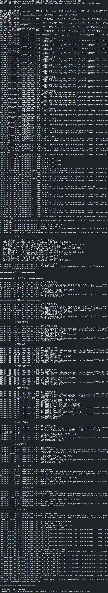

# 论文深入解读工具

这是一个使用智谱AI大模型对学术论文进行深入解读的工具。该工具可以自动分析PDF格式的学术论文，提取关键信息，并生成详细的解读报告。

## 功能特点

- 自动提取论文文本内容和图像
- 识别和解析数学公式
- 按章节分析论文内容
- 生成详细的论文分析计划
- 分析论文的各个关键部分（摘要、研究背景、方法、创新点、实验结果等）
- 输出结构化的解读报告（支持JSON格式和Markdown格式）
- 支持生成美观的Markdown格式分析报告，便于阅读和分享
- 支持论文翻译功能，保留公式、图表和目录结构

## 效果预览

### 翻译效果


### 解读过程



### 解读效果

以[DDPM](Result\DDPM_step_by_step\analysis_result.md)为例进行解读

## 安装依赖

```bash
conda create -n AIPaper python==3.12
conda activate AIPaper
git clone https://github.com/BestDemain/Paper-Analyzer.git
cd Paper-Analyzer
pip install -r requirements.txt
cd ../PDFMathTranslate
pip install -e .
```

主要依赖包括：

- zhipuai>=1.0.7
- PyMuPDF>=1.22.5
- PyPDF2>=3.0.0
- argparse>=1.4.0
- logging>=0.5.1.2
- tqdm>=4.66.1

## 使用方法

### 使用命令行工具 (analyze.py)

```bash
python Analyzer/analyze.py --api_key "your_zhipu_api_key" --pdf "path/to/your/paper.pdf" --output "output_directory" --mode "step_by_step"
```

或者设置环境变量：

```bash
set ZHIPU_API_KEY=your_zhipu_api_key
python Analyzer/analyze.py --pdf "path/to/your/paper.pdf" --output "output_directory"
```

#### 命令行参数说明

- `--api_key`: 智谱AI的API密钥（如果不提供，将尝试从环境变量ZHIPU_API_KEY获取）
- `--model`: 使用的模型名称，默认为glm-4-flash
- `--pdf`: 论文文件路径，默认为Data/DDPM.pdf
- `--output`: 分析结果输出目录，默认为Result/[文件名]_[分析模式]
- `--mode`: 分析模式，可选值：
  - `comprehensive`: 使用综合提示词一次性分析论文
  - `step_by_step`: 分步骤详细分析论文（默认）
  - `both`: 同时使用两种方式分析
- `--use_sections`: 是否使用章节提取功能进行分析，默认为True，可提高分析精度

### 在自己的代码中使用 (paper_analyzer.py)

```python
from Analyzer.paper_analyzer import PaperAnalyzer

# 初始化分析器
analyzer = PaperAnalyzer(
    api_key="your_zhipu_api_key",  # 智谱AI的API密钥
    model="glm-4-flash",  # 使用的模型名称，默认为glm-4-flash
    enable_formula_extraction=True,  # 是否启用公式提取功能，默认为True
    enable_image_extraction=True,  # 是否启用图像提取功能，默认为True
    multimodal_model="glm-4v-flash"  # 多模态模型名称，默认为glm-4v-flash
)

# 分析论文
result, markdown_content = analyzer.analyze_full_paper(
    pdf_path="path/to/your/paper.pdf",  # PDF文件路径
    output_dir="output_directory",  # 分析结果输出路径，默认为None（不保存）
    use_comprehensive_prompt=False,  # 是否使用综合提示词一次性分析论文，默认为False
    use_sections=True,  # 是否使用章节分析，默认为True
    enable_multimodal=True  # 是否启用多模态分析，默认为True
)

# 使用分析结果
print(result["analysis_results"]["摘要解读"])
```

## 分析结果格式

工具支持两种输出格式：

### JSON格式

分析结果以JSON格式保存，包含以下主要部分：

- `paper_path`: 论文文件路径
- `analysis_plan`: 论文分析计划
- `analysis_results`: 各部分的分析结果
  - 基本信息
  - 摘要解读
  - 研究背景
  - 研究方法
  - 创新点
  - 实验结果
  - 结论

## 论文翻译功能

本工具还集成了强大的论文翻译功能，可以将PDF格式的学术论文翻译成多种语言，同时保留公式、图表和目录结构。

### 使用命令行工具 (main.py)

```bash
python PDFMathTranslate/pdf2zh/main.py "path/to/your/paper.pdf" --service "zhipu" --output "output_directory"
```

或者翻译整个目录中的所有PDF文件：

```bash
python PDFMathTranslate/pdf2zh/main.py "path/to/your/directory" --dir --service "zhipu" --output "output_directory"
```

### 命令行参数说明

- `files`: 一个或多个PDF文件路径
- `--service`, `-s`: 使用的翻译服务，默认为"zhipu"，支持多种翻译服务
- `--output`, `-o`: 输出目录，默认为Result/
- `--lang-in`, `-li`: 源语言代码，默认为"en"(英语)
- `--lang-out`, `-lo`: 目标语言代码，默认为"zh"(中文)
- `--pages`, `-p`: 要解析的页码列表，例如"1,3,5-7"
- `--thread`, `-t`: 执行翻译的线程数，默认为4
- `--dir`: 翻译整个目录中的所有PDF文件
- `--interactive`, `-i`: 启用交互式GUI界面
- `--compatible`, `-cp`: 将PDF文件转换为PDF/A格式以提高兼容性
- `--prompt`: 用户自定义提示词文件路径
- `--babeldoc`: 使用实验性后端babeldoc
- `--ignore-cache`: 忽略缓存并强制重新翻译

### 支持的翻译服务

工具支持多种翻译服务，包括但不限于（目前仅支持智谱）：

- 智谱AI (zhipu)
- OpenAI
- Azure OpenAI
- Google
- DeepL
- Bing
- Ollama
- ModelScope
- Gemini
- Tencent
- Xinference
- Argos
- Grok
- Groq
- Deepseek
- 等多种服务

### 交互式GUI界面

可以通过以下命令启动交互式GUI界面：

```bash
python PDFMathTranslate/pdf2zh/main.py --interactive
```

通过GUI界面，您可以更方便地选择文件、设置翻译参数并查看翻译结果。

- 等等
- `extracted_images`: 提取的图像路径列表
- `image_captions`: 图像标题信息

### Markdown格式

工具会额外生成一个Markdown格式的解读报告，文件名为 `analysis_result.md`。Markdown报告具有以下特点：

- 结构清晰，便于阅读和分享
- 自动处理JSON内容的格式化
- 支持多级标题和章节组织
- 保持与JSON输出相同的分析深度和内容质量

## 输出目录结构

当使用 `analyze.py`进行分析时，会在指定的输出目录生成以下文件：

```
output_directory/
├── analysis_plan.json       # 论文分析计划
├── analysis_result.json     # 分析结果（JSON格式）
├── analysis_result.md       # 分析结果（Markdown格式）
├── paper_sections.json      # 提取的论文章节信息
└── images/                  # 提取的图像目录
    ├── image_1.jpg
    ├── image_2.jpg
    └── ...
```

## 注意事项

- 需要有效的智谱AI API密钥
- 处理大型论文时可能需要较长时间
- 分析结果的质量取决于智谱AI模型的能力
- 公式提取和图像提取功能可能受PDF格式和质量影响
