# 论文深度解读报告

## 提取论文基本信息

**论文基本信息提取与分析**：

**标题**： Denoising Diffusion Probabilistic Models

**作者**： 未提供具体作者信息，但论文中提到了多个相关研究和贡献者，如Guillaume Alain, Yoshua Bengio等。

**发表年份**： 2020年12月16日

**期刊/会议信息**： 
- 发表于第34届神经信息处理系统大会（NeurIPS 2020），地点：加拿大温哥华。
- 论文编号：arXiv:2006.11239v2

**分析**：

这篇论文介绍了扩散概率模型（Denoising Diffusion Probabilistic Models，简称DDPM），这是一种受非平衡热力学启发的潜在变量模型。DDPM通过训练一个马尔可夫链来生成与数据匹配的样本，该链的转移被学习以逆转一个扩散过程，即逐渐向数据中添加噪声的过程，直到信号被破坏。

**公式解读**：

论文中提到了以下公式：

$$xT \rightarrow x_{T-1} \rightarrow \cdots \rightarrow x_1 \rightarrow x_0$$

这个公式描述了扩散过程，其中数据点 $x_0$ 逐渐被噪声污染，直到最终变为 $x_T$。这个过程是可逆的，即可以通过反向过程从 $x_T$ 重建 $x_0$。

$$p(x_{t-1}|x_t)$$

这个公式表示从 $x_t$ 到 $x_{t-1}$ 的条件概率。在DDPM中，这个概率被建模为一个条件高斯分布。

$$q(x_t|x_{t-1})$$

这个公式表示从 $x_{t-1}$ 到 $x_t$ 的先验概率。在DDPM中，这个概率被建模为一个条件高斯分布。

**总结**：

这篇论文提出了DDPM，这是一种高效且易于训练的生成模型。DDPM在图像生成任务中取得了优异的性能，并展示了其在其他数据模态和机器学习系统中的潜力。

## 摘要解读与扩展

### 摘要解读

**研究问题**：
该论文主要研究扩散概率模型（Diffusion Models）在生成高质量样本方面的能力，并探讨其与去噪评分匹配、退火朗之万动力学和自回归模型之间的关系。

**方法**：
1. 提出了一种基于扩散概率模型的生成模型，通过学习一个马尔可夫链的反向过程来生成样本。
2. 将扩散模型与去噪评分匹配和退火朗之万动力学联系起来，并提出了一种简化的变分界限目标函数。
3. 通过实验验证了扩散模型在生成高质量样本方面的能力，并分析了其与自回归模型和渐进损失压缩的关系。

**结果**：
1. 扩散模型能够生成高质量样本，在某些情况下甚至优于其他生成模型。
2. 扩散模型与去噪评分匹配和退火朗之万动力学之间存在等价性。
3. 扩散模型的采样过程类似于自回归模型的渐进解码。

**结论**：
扩散模型是一种有效的生成模型，能够生成高质量样本，并具有与自回归模型和渐进损失压缩的关系。

### 扩展分析

**背景和意义**：
1. **背景**：近年来，深度生成模型在各个数据模态上取得了显著的进展，如生成对抗网络（GANs）、自回归模型、流和变分自编码器（VAEs）等。然而，这些模型在生成高质量样本方面仍然存在一些挑战。
2. **意义**：扩散模型作为一种新的生成模型，具有以下意义：
    - 提供了一种新的生成高质量样本的方法。
    - 将扩散模型与去噪评分匹配、退火朗之万动力学和自回归模型联系起来，为生成模型的研究提供了新的视角。
    - 为数据压缩和表示学习等领域提供了新的思路。

**公式解读**：

1. **公式（1）**：描述了扩散模型中反向过程的概率分布，其中 $x_1, . . . , x_T$ 是与数据 $x_0$ 同维度的潜在变量，$p(x_0)$ 是先验分布。
2. **公式（2）**：描述了扩散模型中正向过程的概率分布，其中 $q(x_1: T | x_0)$ 是扩散过程，$x_1, . . . , x_T$ 是与数据 $x_0$ 同维度的潜在变量。
3. **公式（3）**：描述了扩散模型的变分界限目标函数，其中 $L$ 是变分界限，$q(x_1: T | x_0)$ 是扩散过程，$p(x_0)$ 是先验分布。
4. **公式（4）**：描述了扩散模型中正向过程的采样过程，其中 $x_t$ 是在时间步 $t$ 采样的样本，$x_0$ 是初始样本，$\epsilon$ 是高斯噪声。
5. **公式（5）**：描述了扩散模型的变分界限目标函数，其中 $D_{KL}$ 是KL散度，$q(x_1: T | x_0)$ 是扩散过程，$p(x_0)$ 是先验分布。
6. **公式（6）**：描述了扩散模型中反向过程的概率分布，其中 $\mu_t$ 是均值函数，$\Sigma_t$ 是协方差矩阵。
7. **公式（7）**：描述了扩散模型中反向过程的均值函数，其中 $\mu_t$ 是均值函数，$\Sigma_t$ 是协方差矩阵。
8. **公式（8）**：描述了扩散模型中反向过程的变分界限目标函数，其中 $\mu_t$ 是均值函数，$\Sigma_t$ 是协方差矩阵。
9. **公式（9）**：描述了扩散模型中反向过程的变分界限目标函数，其中 $\mu_t$ 是均值函数，$\Sigma_t$ 是协方差矩阵。
10. **公式（10）**：描述了扩散模型中反向过程的变分界限目标函数，其中 $\mu_t$ 是均值函数，$\Sigma_t$ 是协方差矩阵。
11. **公式（11）**：描述了扩散模型中反向过程的均值函数，其中 $\mu_t$ 是均值函数，$\Sigma_t$ 是协方差矩阵。
12. **公式（12）**：描述了扩散模型中反向过程的变分界限目标函数，其中 $\mu_t$ 是均值函数，$\Sigma_t$ 是协方差矩阵。
13. **公式（13）**：描述了扩散模型中反向过程的离散解码器，其中 $D$ 是数据维度，$i$ 是坐标索引。
14. **公式（14）**：描述了扩散模型的简化变分界限目标函数，其中 $t$ 是时间步。
15. **公式（15）**：描述了扩散模型的渐进损失压缩过程，其中 $x_0$ 是原始

## 研究背景与意义分析

研究背景分析：

1. **相关领域研究现状**：
   - **扩散模型**：扩散模型是一类基于潜在变量的生成模型，它通过将数据逐步添加高斯噪声，使其变为高斯分布，然后通过反向过程进行去噪，从而生成新的数据。与传统的生成模型（如VAEs和GANs）相比，扩散模型具有参数少、生成质量高等优点。
   - **变分推理**：变分推理是一种用于近似后验分布的方法，它通过优化变分下界来逼近真实后验分布。在生成模型中，变分推理被广泛应用于优化目标函数，提高生成质量。

2. **论文提出的模型在其中的地位和意义**：
   - **模型概述**：本文提出的模型基于扩散模型，通过引入新的参数化方法，简化了训练过程，并提高了生成质量。
   - **模型地位**：该模型在扩散模型的基础上，对反向过程进行了改进，使其能够更好地拟合数据分布，从而提高生成质量。
   - **模型意义**：
     - **提高生成质量**：通过引入新的参数化方法，该模型能够更好地拟合数据分布，从而提高生成质量。
     - **简化训练过程**：该模型简化了训练过程，降低了计算复杂度，提高了训练效率。
     - **推动扩散模型发展**：该模型为扩散模型的研究提供了新的思路，有助于推动扩散模型的发展。

公式解读：

1. **公式(1)**：该公式描述了扩散模型中反向过程的概率密度函数。其中，$x_1, \ldots, x_T$ 是潜在变量，$x_0$ 是数据点，$q(x_0)$ 是先验分布。
   $$p_{\theta}(x_0: T) := \int_{x_1}^{x_T} p_{\theta}(x_0: T | x_1) p_{\theta}(x_1) dx_1$$
   其中，$p_{\theta}(x_0: T | x_1)$ 是条件概率密度函数。

2. **公式(2)**：该公式描述了扩散模型中正向过程的概率密度函数。其中，$x_1, \ldots, x_T$ 是潜在变量，$x_0$ 是数据点，$q(x_0)$ 是先验分布。
   $$q(x_1: T | x_0) := \prod_{t=1}^{T} q(x_t | x_{t-1})$$
   其中，$q(x_t | x_{t-1})$ 是条件概率密度函数。

3. **公式(3)**：该公式描述了扩散模型的训练目标，即优化负对数似然函数。
   $$E[-\log p_{\theta}(x_0)] \leq E_{q(x_1: T | x_0)}[-\log p_{\theta}(x_0: T | x_1)]$$
   其中，$p_{\theta}(x_0: T | x_1)$ 是条件概率密度函数。

4. **公式(4)**：该公式描述了扩散模型中正向过程的采样方法。其中，$\alpha_t := 1 - \beta_t$，$\bar{\alpha}_t := \prod_{s=1}^{t} \alpha_s$。
   $$q(x_t | x_0) = N(x_t; \sqrt{\bar{\alpha}_t} x_0, (\bar{\alpha}_t - 1) I)$$

5. **公式(5)**：该公式描述了扩散模型的变分下界。其中，$D_{KL}$ 表示KL散度。
   $$E_{q(x_T | x_0)}[D_{KL}(q(x_T | x_0) \parallel p(x_T))] + \sum_{t=1}^{T} E_{q(x_{t-1} | x_t, x_0)}[D_{KL}(q(x_{t-1} | x_t, x_0) \parallel p_{\theta}(x_{t-1} | x_t))] - \log p_{\theta}(x_0 | x_1)$$

6. **公式(6)**：该公式描述了扩散模型中反向过程的条件概率密度函数。
   $$q(x_{t-1} | x_t, x_0) = N(x_{t-1}; \tilde{\mu}_t(x_t, x_0), \tilde{\beta}_t I)$$
   其中，$\tilde{\mu}_t(x_t, x_0)$ 和 $\tilde{\beta}_t$ 分别是均值和方差。

7. **公式(7)**：该公式描述了扩散模型中反向过程的均值和方差。
   $$\tilde{\mu}_t(x_t, x_0) := \sqrt{\bar{\alpha}_{t-1}} \beta_t \frac{1 - \bar{\alpha}_{t-1}}{\sqrt{\bar{\alpha}_t}} x_0 + \sqrt{\alpha_t} \frac{1 - \bar{\alpha}_{t-1}}{\sqrt{\bar{\alpha}_t}} x_t$$
   $$\tilde{\beta}_t := \frac{1 - \bar{\alpha}_{t-1}}{1 - \bar{\alpha}_t} \beta_t$$

8. **公式(8)**：该公式描述了扩散模型中反向过程的损失函数。
   $$L_{t-1} = E_{q(x_0, \epsilon)}\left[\frac{1}{2} \sigma_t^2 \parallel \tilde{\mu}_t(x_t, x_0) - \mu_{\theta}(x_t, t) \parallel^2 + C\right]$$
   其中，$C$ 是一个常数。

9. **公式(9)**：该公式描述了扩散模型中反向过程的损失函数的进一步展开。
   $$L_{t-1} - C = E_{x_0, \epsilon} \left[\frac{1}{2} \sigma_t^2 \left(\frac{\tilde{\mu}_t(x_t, x_0)}{\sqrt{\bar{\alpha}_t}} x_t - \frac{\sqrt{1 - \bar{\alpha}_t} \epsilon}{\sqrt{\bar{\alpha}_t}}\right) - \mu_{\theta}(x_t, t)\right]^2 \right]$$

10. **公式(10)**：该公式描述了扩散模型中反向过程的均值函数的参数化方法。
    $$\mu_{\theta}(x_t, t) = \frac{\tilde{\mu}_t(x_t, x_0)}{\sqrt{\bar{\alpha}_t}} x_t - \frac{\sqrt{1 - \bar{\alpha}_t} \epsilon_{\theta}(x_t, t)}{\sqrt{\bar{\alpha}_t}}$$
    其中，$\epsilon_{\theta}$ 是一个函数近似器，用于预测 $\epsilon$。

## 研究方法详解

这篇论文提出了一种基于扩散模型的生成对抗网络（GAN），并详细介绍了其研究方法。以下是论文中提出的扩散概率模型的分析：

### 模型结构

1. **正向过程**：模型首先将数据通过一系列的噪声添加过程转换为噪声数据。在这个过程中，噪声的方差 $\beta_t$ 是固定的，并且与时间 $t$ 相关。正向过程的方差 $\beta_t$ 可以通过重新参数化进行学习，但在论文中，作者将其固定为常数。

2. **反向过程**：反向过程用于从噪声数据中恢复原始数据。它通过一系列的解噪步骤来实现，每个步骤都尝试去除一部分噪声。反向过程的均值函数 $\mu_\theta(x_t, t)$ 和协方差矩阵 $\Sigma_\theta(x_t, t)$ 是通过神经网络进行学习的。

### 训练过程

1. **数据预处理**：图像数据被缩放到 [-1, 1] 范围内，以便神经网络可以处理。

2. **反向过程解码器**：使用 U-Net 架构作为反向过程的解码器，该架构类似于未掩码的 PixelCNN++。

3. **训练目标**：论文中提出了一个简化的训练目标 $L_{\text{simple}}(\theta)$，它类似于变分边界，但丢弃了权重，从而强调了不同方面的重建。

4. **梯度下降**：使用梯度下降算法来优化反向过程均值函数的参数。

### 采样过程

1. **初始化**：从标准正态分布中采样 $x_T$。

2. **反向过程采样**：通过一系列的解噪步骤，从 $x_T$ 逐步采样到 $x_0$。

3. **参数化**：使用公式 (11) 来参数化均值函数 $\mu_\theta(x_t, t)$。

4. **采样**：使用公式 (12) 来计算 $x_{t-1}$。

### 公式解读

1. **公式 (8)**：描述了 $L_{t-1}$ 的表达式，其中 $C$ 是一个常数，$\tilde{\mu}_t$ 是正向过程的后验均值。

2. **公式 (9)**：通过重新参数化公式 (4) 并应用正向过程的后验公式 (7)，进一步扩展了公式 (8)。

3. **公式 (10)**：描述了 $\mu_\theta$ 必须预测的表达式。

4. **公式 (11)**：参数化 $\mu_\theta(x_t, t)$。

5. **公式 (12)**：描述了 $L_{\text{simple}}(\theta)$ 的表达式。

6. **公式 (13)**：定义了离散解码器。

7. **公式 (14)**：定义了简化的训练目标 $L_{\text{simple}}(\theta)$。

8. **公式 (15)**：描述了渐进生成过程中的 $x_0$ 的估计。

9. **公式 (16)**：将变分边界重新写成另一种形式。

### 总结

这篇论文提出的扩散概率模型是一种有效的生成模型，它通过一系列的噪声添加和解噪步骤来生成高质量的样本。论文中详细介绍了模型的结构、训练过程和采样过程，并提供了丰富的实验结果来验证模型的有效性。

## 关键创新点识别与分析

在这篇论文中，我们可以识别出以下几个关键创新点：

1. **新型连接**：
   - 使用了U-Net作为骨干网络来表示反向过程，类似于未掩码的PixelCNN++，并使用了组归一化。
   - 网络参数在时间上共享，并使用Transformer正弦位置嵌入来指定时间信息。

2. **参数化方法**：
   - 将反向过程方差参数化，而不是使用固定的常数，以提高模型的灵活性和稳定性。
   - 使用自注意力机制在16×16特征图分辨率上。

3. **训练目标**：
   - 提出了简化的训练目标，以提高样本质量。
   - 通过预测ε而不是预测均值来改进样本质量。
   - 使用真实变分界限进行训练，以获得更好的码长。

以下是对这些创新点的详细分析：

### 新型连接

**U-Net骨干网络**：
论文中使用的U-Net网络结构可以有效地学习图像的空间上下文信息。这种结构在图像处理领域已经得到了广泛的应用，尤其是在语义分割和图像重建任务中。使用U-Net作为反向过程的骨干网络，有助于模型更好地捕捉图像的细节和复杂结构。

**组归一化**：
组归一化可以减少内部协变量偏移，提高模型训练的稳定性和收敛速度。在U-Net网络中引入组归一化，可以进一步优化模型性能。

**Transformer正弦位置嵌入**：
使用Transformer正弦位置嵌入来指定时间信息，可以使得模型更好地处理时间序列数据。这种嵌入方式可以帮助模型学习到时间序列数据中的周期性和长期依赖关系。

### 参数化方法

**反向过程方差参数化**：
通过参数化反向过程方差，模型可以更好地适应不同的数据分布和噪声水平。这种方法可以提高模型的灵活性和鲁棒性。

**自注意力机制**：
自注意力机制可以使得模型在处理图像数据时，更好地捕捉局部和全局的依赖关系。在16×16特征图分辨率上使用自注意力机制，可以有效地提高模型的性能。

### 训练目标

**简化的训练目标**：
论文中提出的简化训练目标，通过预测ε而不是预测均值，可以有效地提高样本质量。这种方法可以减少模型对噪声的敏感度，从而提高生成的图像质量。

**真实变分界限**：
使用真实变分界限进行训练，可以使得模型更好地学习数据分布。这种方法可以提高模型的泛化能力和样本质量。

### 公式解读

以下是对论文中出现的公式进行解读：

$$D_{KL}(q(x_T|x_0) \parallel N(0, I))$$
这个公式表示了真实分布和先验分布之间的KL散度，其中q(x_T|x_0)表示真实分布，N(0, I)表示高斯分布。

$$\tilde{\mu}$$
这个符号表示了预测的均值。

$$\epsilon$$
这个符号表示了预测的噪声。

$$\frac{L_1 + \cdots + L_T}{L_0}$$
这个表达式表示了变分界限的分子部分，其中L_i表示第i个变分界限项。

$$\sqrt{\frac{L_0}{L_1 + \cdots + L_T}}$$
这个表达式表示了变分界限的分母部分。

$$\hat{x}_0 = x_t - \sqrt{1 - \bar{\alpha}_t \epsilon_\theta(x_t)} / \sqrt{\bar{\alpha}_t}$$
这个公式表示了在渐进式生成过程中，根据部分信息xt估计x_0的方法。

以上是对论文中关键创新点的识别和分析。这些创新点为扩散模型在图像生成和图像重建等领域提供了新的思路和方法。

## 公式推导再现与解读

## 公式解读 - 第一部分：公式背景、意义和符号解释

### 公式解读

以下是对论文中提到的公式的深入解读：

#### 1. 公式的来源和背景

论文中提到的公式主要涉及扩散模型（Diffusion Models）和去噪评分匹配（Denoising Score Matching）。扩散模型是一种生成模型，通过逐步向数据中添加噪声，然后逐步去除噪声来生成新的样本。去噪评分匹配是一种基于评分匹配的优化方法，用于训练生成模型。

#### 2. 公式的应用场景和意义

这些公式在论文中的作用是：

- **公式 (8)** 和 **公式 (9)**：用于分析反向过程中的均值函数 $\mu_{\theta}(x_t, t)$ 的参数化方式，为训练模型提供理论基础。
- **公式 (10)**：揭示了 $\mu_{\theta}$ 必须预测的值，为采样过程提供指导。
- **公式 (11)**：提供了一个具体的参数化方法，用于预测 $\epsilon$，从而简化了扩散模型的变分界限。
- **公式 (12)**：展示了 $\epsilon$-预测参数化与Langevin动力学的关系，并简化了扩散模型的变分界限。
- **公式 (14)**：提供了一个简化的变分界限，用于训练模型，并提高了采样质量。

#### 3. 公式的数学符号和符号意义

以下是对论文中公式中出现的数学符号的解读：

- **$x_t$**：表示第 $t$ 个时间步的样本。
- **$x_0$**：表示初始样本。
- **$p$**：表示概率分布。
- **$q$**：表示近似后验分布。
- **$\theta$**：表示模型的参数。
- **$\mu_{\theta}(x_t, t)$**：表示反向过程中的均值函数。
- **$\sigma_t$**：表示第 $t$ 个时间步的噪声方差。
- **$\alpha_t$**：表示第 $t$ 个时间步的噪声比例。
- **$\beta_t$**：表示第 $t$ 个时间步的前向过程方差。
- **$\epsilon$**：表示噪声。
- **$D$**：表示数据维度。
- **$KL$**：表示KL散度。
- **$H$**：表示熵。

### 总结

通过对论文中公式的解读，我们可以更好地理解扩散模型和去噪评分匹配的原理，以及它们在生成模型中的应用。这些公式为训练和优化生成模型提供了理论基础，并有助于提高采样质量。

## 公式解读 - 第二部分：公式推导过程和应用实例

### 公式 (8) 的推导过程

公式 (8) 是关于扩散模型中后验均值预测的公式，其内容如下：

$$L_{t-1} = \mathbb{E}_{x_0, \epsilon} \left[ \frac{1}{2\sigma_t^2} \left\| \tilde{\mu}_t(x_0, x) - \mu_\theta(x_t, t) \right\|^2 + C \right]$$

其中，$L_{t-1}$ 是第 $t-1$ 步的损失函数，$\sigma_t^2$ 是时间 $t$ 的噪声方差，$\tilde{\mu}_t(x_0, x)$ 是前向过程的后验均值，$\mu_\theta(x_t, t)$ 是模型预测的后验均值，$C$ 是一个常数。

以下是公式 (8) 的推导过程：

1. **定义损失函数**：
   损失函数 $L_{t-1}$ 是后验均值预测的误差平方和，加上一个常数项 $C$。

2. **期望值**：
   期望值 $\mathbb{E}_{x_0, \epsilon}$ 表示对 $x_0$ 和 $\epsilon$ 的联合分布进行积分。

3. **噪声方差**：
   噪声方差 $\sigma_t^2$ 是时间 $t$ 的噪声标准差平方。

4. **误差平方**：
   误差平方 $\left\| \tilde{\mu}_t(x_0, x) - \mu_\theta(x_t, t) \right\|^2$ 是前向过程后验均值和模型预测后验均值之间的差异平方。

5. **常数项**：
   常数项 $C$ 是一个与参数 $\theta$ 无关的常数。

### 公式 (9) 的推导过程

公式 (9) 是公式 (8) 的进一步展开，其内容如下：

$$L_{t-1} - C = \mathbb{E}_{x_0, \epsilon} \left[ \frac{1}{2\sigma_t^2} \left( \sqrt{\alpha_t} \left( x_t(x_0, \epsilon) - \sqrt{1-\alpha_t} \epsilon \right) - \mu_\theta(x_t(x_0, \epsilon), t) \right)^2 \right]$$

以下是公式 (9) 的推导过程：

1. **重参数化**：
   将公式 (4) 重参数化为 $x_t(x_0, \epsilon) = \sqrt{\alpha_t} x_0 + \sqrt{1-\alpha_t} \epsilon$，其中 $\epsilon \sim N(0, I)$。

2. **应用前向过程后验公式**：
   使用前向过程的后验公式 $\mu_\theta(x_t(x_0, \epsilon), t) = \tilde{\mu}_t(x_0, x_t(x_0, \epsilon))$。

3. **代入公式 (8)**：
   将重参数化和前向过程后验公式代入公式 (8)。

4. **化简**：
   对公式进行化简，得到公式 (9)。

### 公式 (10) 的推导过程

公式 (10) 是公式 (9) 的进一步化简，其内容如下：

$$\mathbb{E}_{x_0, \epsilon} \left[ \frac{1}{2\sigma_t^2} \left( \sqrt{\alpha_t} \left( x_t(x_0, \epsilon) - \sqrt{1-\alpha_t} \epsilon \right) - \mu_\theta(x_t(x_0, \epsilon), t) \right)^2 \right]$$

以下是公式 (10) 的推导过程：

1. **展开平方项**：
   将平方项展开，得到一个关于 $x_0$ 和 $\epsilon$ 的表达式。

2. **期望值**：
   对 $x_0$ 和 $\epsilon$ 的联合分布进行积分，得到期望值。

3. **化简**：
   对期望值进行化简，得到公式 (10)。

### 公式 (11) 的推导过程

公式 (11) 是模型参数化的一种形式，其内容如下：

$$\mu_\theta(x_t, t) = \tilde{\mu}_t(x_t, \sqrt{\alpha_t} (x_t - \sqrt{1-\alpha_t} \epsilon_\theta(x_t, t)))$$

以下是公式 (11) 的推导过程：

1. **预测 $\epsilon_\theta$**：
   假设 $\epsilon_\theta$ 是一个函数逼近器，用于从 $x_t$ 预测 $\epsilon$。

2. **参数化 $\mu_\theta$**：
   使用公式 (10) 中的结果，将 $\mu_\theta$ 参数化为 $\tilde{\mu}_t$，其中 $\epsilon$ 使用 $\epsilon_\theta$ 进行预测。

3. **代入公式 (10)**：
   将参数化后的 $\mu_\theta$ 代入公式 (10)。

4. **化简**：
   对公式进行化简，得到公式 (11)。

## 实验设计与结果分析

### 实验设计与结果分析

#### 1. 实验设计

**数据集**：
- CIFAR10：用于样本质量评估。
- LSUN Church 和 LSUN Bedroom：用于展示模型在自然图像上的性能。

**评价指标**：
- Inception scores：用于衡量样本质量。
- FID scores：用于衡量样本的真实性。
- 负对数似然（lossless codelengths）：用于衡量模型的压缩效率。

**实验设置**：
- 设置 $T = 1000$，确保神经网络评估次数与先前工作一致。
- 前向过程方差设置为从 $β_1 = 10^{-4}$ 线性增加到 $β_T = 0.02$。
- 使用 U-Net 作为反向过程的骨干网络，并使用 Transformer 线性位置嵌入。
- 使用自注意力机制，在 $16 \times 16$ 特征图分辨率上进行。

#### 2. 实验结果解读

**样本质量**：
- 在 CIFAR10 上，模型的 FID 分数为 3.17，优于大多数文献中的模型，包括类条件模型。
- 在 LSUN Church 和 LSUN Bedroom 上，模型的 FID 分数分别为 7.89 和 4.90，表明模型在自然图像上也有很好的性能。

**反向过程参数化和训练目标消融实验**：
- 基线选项预测 $\tilde{\mu}$ 在训练真实变分界限时表现良好，而在训练加权均方误差时表现不佳。
- 学习反向过程方差会导致训练不稳定和样本质量下降，而预测 $\epsilon$ 可以获得更好的性能。

**渐进编码**：
- 模型的渐进编码损失率与测试集之间的差距最大为 0.03 比特/维度，表明模型没有过拟合。
- 模型的无损编码长度优于基于能量的模型和分数匹配，但不如其他类型的基于似然的可生成模型。

**渐进损失压缩**：
- 通过引入渐进损失压缩，可以进一步研究模型的速率-失真行为。
- 在低速率区域，失真急剧下降，表明大多数比特都分配给了不可察觉的失真。

**渐进生成**：
- 通过渐进无条件生成过程，可以预测反向过程的输出，并逐步恢复图像细节。
- 大规模图像特征首先出现，细节最后出现，这可能表明模型具有概念压缩的能力。

**与自回归解码的关系**：
- 将变分界限重新写为自回归解码的形式，可以解释高斯扩散模型为一种具有广义位序的自回归模型。
- 这种模型可以更有效地生成样本，并具有更好的样本质量。

**插值**：
- 使用反向过程在潜在空间中插值源图像，可以生成高质量的重构和插值图像。
- 大的 $t$ 值会导致更粗糙和更多样的插值，但在 $t = 1000$ 时会产生新颖的样本。

### 公式解读

- **公式 (5)**：变分界限，用于衡量模型生成的样本质量。
- **公式 (15)**：渐进生成过程中，逐步恢复图像细节的公式。
- **公式 (16)**：将变分界限重新写为自回归解码的形式。

### 总结

该论文通过实验验证了高斯扩散模型在生成高质量样本和图像压缩方面的有效性。实验结果表明，该模型在样本质量、速率-失真行为和插值等方面都表现出良好的性能。此外，论文还探讨了模型与自回归解码的关系，并提出了渐进生成和插值方法，进一步提高了模型的性能。

## 结论与贡献总结

### 主要结论

这篇论文的主要结论可以总结如下：

1. **扩散模型在图像生成中的有效性**：论文展示了使用扩散模型生成高质量图像样本的能力，并指出扩散模型在图像数据上具有出色的归纳偏差。

2. **与现有技术的联系**：论文探讨了扩散模型与变分推理、去噪得分匹配、退火拉格朗日动力学（以及基于能量的模型）、自回归模型和渐进式有损压缩之间的联系。

3. **样本质量**：论文通过实验表明，他们的无条件模型在样本质量上优于大多数文献中的模型，包括类条件模型。

4. **渐进式编码**：论文展示了扩散模型在渐进式编码中的潜力，表明扩散模型具有很好的无损压缩能力。

5. **与自回归模型的联系**：论文将扩散模型与自回归模型联系起来，指出扩散模型可以视为一种具有广义位序的自回归模型。

### 主要贡献

论文的主要贡献包括：

1. **改进扩散模型**：论文提出了一种改进的扩散模型，通过使用简化目标函数，提高了样本质量。

2. **渐进式有损压缩**：论文展示了扩散模型在渐进式有损压缩中的潜力，表明扩散模型可以作为一种有效的压缩工具。

3. **与自回归模型的联系**：论文将扩散模型与自回归模型联系起来，为理解扩散模型的工作原理提供了新的视角。

4. **对现有技术的启示**：论文的工作为其他数据模态和机器学习系统中的生成模型提供了新的思路。

### 公式解读

论文中的一些关键公式如下：

1. **扩散过程**：
   $$x_t \sim q(x_t|x_{t-1}) \quad \text{for} \quad t = 1, 2, \ldots, T$$
   这表示在时间步 $t$，状态 $x_t$ 是根据前一个状态 $x_{t-1}$ 生成的。

2. **变分界限**：
   $$L = D_{KL}(q(x_T) \parallel p(x_T)) + \mathbb{E}_{x_{T-1} \sim q(x_{T-1}|x_0)} \left[ D_{KL}(q(x_{T-1}|x_T) \parallel p(x_{T-1}|x_T)) \right] + H(x_0)$$
   这表示变分界限，用于衡量生成模型与真实数据分布之间的差异。

3. **渐进式生成**：
   $$\hat{x}_0 = x_t - \sqrt{1 - \bar{\alpha}_t \epsilon_\theta(x_t)} / \sqrt{\bar{\alpha}_t}$$
   这表示在渐进式生成过程中，接收者如何根据部分信息逐步估计原始样本。

### 深入分析

这篇论文在图像生成领域做出了重要贡献。通过改进扩散模型，论文展示了其在生成高质量图像样本方面的潜力。此外，论文还探讨了扩散模型与其他生成模型和机器学习系统之间的联系，为未来的研究提供了新的思路。

论文中提出的改进方法，如简化目标函数和渐进式有损压缩，为扩散模型的应用提供了新的可能性。此外，论文将扩散模型与自回归模型联系起来，为理解扩散模型的工作原理提供了新的视角。

总之，这篇论文在图像生成领域具有很高的学术价值和实际应用价值。

## 局限性与未来研究方向

### 论文的局限性与不足

1. **实验设置**：
   - 论文中所有实验中，时间步长 $T$ 被设置为 1000，这可能导致模型对时间步长变化的敏感度不足。未来的研究可以考虑不同时间步长对模型性能的影响。
   - 前向过程方差被设置为常数，从 $\beta_1 = 10^{-4}$ 线性增加到 $\beta_T = 0.02$。这种设置可能限制了模型的表达能力。未来的研究可以探索更复杂的方差设置。

2. **模型参数化**：
   - 论文中提到，预测 $\tilde{\mu}$ 在训练真实变分界限时效果较好，但在训练简化目标时效果较差。这表明模型对参数化的敏感度较高。未来的研究可以探索更鲁棒的参数化方法。
   - 学习反向过程方差可能导致训练不稳定和样本质量下降。未来的研究可以探索更稳定的方差学习策略。

3. **样本质量**：
   - 虽然模型在 CIFAR10 和 LSUN 数据集上取得了较好的样本质量，但与其他类型的生成模型相比，其无损码长并不具有竞争力。未来的研究可以探索提高模型生成样本质量的方法。

4. **渐进式编码**：
   - 论文中提到，扩散模型具有很好的归纳偏置，使其成为优秀的有损压缩器。然而，模型在低速率区域具有较大的失真。未来的研究可以探索改进渐进式编码方法，以降低失真。

### 未来研究方向

1. **时间步长的影响**：
   - 探索不同时间步长对模型性能的影响，以找到最佳的时间步长设置。

2. **方差学习**：
   - 研究更鲁棒的方差学习策略，以提高模型的表达能力和稳定性。

3. **参数化方法**：
   - 探索更鲁棒的参数化方法，以提高模型对参数变化的敏感度。

4. **样本质量提升**：
   - 研究提高模型生成样本质量的方法，例如改进模型结构、训练策略等。

5. **渐进式编码改进**：
   - 探索改进渐进式编码方法，以降低失真。

6. **模型应用**：
   - 将扩散模型应用于其他数据模态，例如文本、音频等。
   - 将扩散模型作为其他类型生成模型和机器学习系统的组件。

7. **安全性问题**：
   - 研究防止恶意使用生成模型的方法，例如检测伪造图像和视频等。

8. **数据压缩**：
   - 探索将扩散模型应用于数据压缩，以提高数据传输效率。

9. **无监督学习**：
   - 研究利用扩散模型进行无监督学习，例如图像分类、强化学习等。

10. **艺术创作**：
    - 探索将扩散模型应用于艺术创作，例如绘画、摄影、音乐等。

## 相关工作与文献综述分析

### 相关工作分析

论文中提到了几种与扩散模型相关的工作，以下是对这些工作的分析：

1. **扩散模型与流模型和VAEs的比较**：
   - **流模型**：扩散模型与流模型在形式上相似，但扩散模型的关键特性是它的前向过程（扩散过程）没有参数，且顶层潜在变量$x_T$与数据$x_0$之间的互信息几乎为零。这一点在公式(2)中得到了体现。
   - **变分自编码器（VAEs）**：VAEs与扩散模型在结构上有相似之处，但扩散模型在训练和推理上有所不同。

2. **ε-预测反向过程参数化**：
   - 这种参数化方法建立了扩散模型与多个噪声水平上的去噪分数匹配之间的联系，使用退火Langevin动力学进行采样。这种方法在公式(4)中得到了体现。

3. **变分推理训练Langevin动力学采样器**：
   - 扩散模型允许直接进行对数似然评估，并且训练过程通过变分推理显式地训练Langevin动力学采样器。

4. **其他方法学习马尔可夫链的转移算子**：
   - 包括注入训练、变分回溯、生成随机网络等方法。

5. **与能量模型的关系**：
   - 论文提到与分数匹配和基于能量的建模之间的已知联系，这可能对其他基于能量的模型工作产生影响。

6. **速率失真曲线的计算**：
   - 论文中的速率失真曲线是在一次评估变分界时按时间计算的，类似于退火重要性采样运行中按失真惩罚计算速率失真曲线。

7. **渐进解码论证**：
   - 与卷积DRAW和相关模型中的论证相似，这可能为子尺度排序或自回归模型的采样策略提供更通用的设计。

### 文献综述

以下是对论文中引用的文献的综述：

- [9,$$46$$,$$10$$,$$32$$,$$5$$,$$16$$,$$23$$]：这些文献可能涉及扩散模型、流模型和VAEs的研究。
- [33,$$47$$,$$37$$]：这些文献可能讨论了VAEs和相关的工作。
- [55,$$56$$]：这些文献可能涉及退火Langevin动力学和去噪分数匹配。
- [2,$$15$$,$$1$$,$$50$$,$$54$$,$$36$$,$$42$$,$$35$$,$$65$$]：这些文献可能涉及马尔可夫链转移算子的学习方法。
- [67–69,$$12$$,$$70$$,$$13$$,$$11$$,$$41$$,$$17$$,$$8$$]：这些文献可能涉及基于能量的模型。
- [24]：这篇文献可能讨论了退火重要性采样。
- [18,$$40$$]：这些文献可能涉及卷积DRAW和相关模型。
- [38,$$64$$]：这些文献可能涉及自回归模型的子尺度排序或采样策略。

### 公式解读

- 公式(1)定义了扩散模型的反向过程，它是一个马尔可夫链，从$x_T$开始，通过一系列高斯转移逐步添加噪声。
- 公式(2)定义了扩散模型的前向过程，它是一个马尔可夫链，逐步添加高斯噪声到数据$x_0$。
- 公式(3)定义了训练过程中优化的负对数似然上的变分下界。
- 公式(4)提供了在任意时间步$t$采样$xt$的闭式表达式。
- 公式(5)是重写的变分下界，使用KL散度直接比较$p_{\theta}(x_{t-1}|x_t)$与前向过程后验。
- 公式(6)和(7)定义了条件高斯分布的参数，用于KL散度的计算。

这些公式和文献综述提供了对扩散模型和相关工作的深入理解，并展示了论文在现有研究基础上的贡献和创新点。

## 关键图表解读

抱歉，我刚刚的回复有误，下面是对您提供的论文内容的分析和解答：

### 关键图表解读

#### 图表1：生成的样本图像
##### 主要内容和目的
- **主要内容**：展示了在CelebA-HQ 256×256和CIFAR10数据集上生成的样本图像。
- **目的**：通过可视化生成的样本图像来评估模型的生成质量。

##### 关键数据和趋势
- **CelebA-HQ 256×256**：左上图显示了生成的面部图像，展示了高分辨率的细节和自然的外观。
- **CIFAR10**：右下图展示了生成的低分辨率图像，涵盖了多种类别（如动物、车辆、飞机等），显示出多样化的生成能力。

##### 支持论文论点和结论
- 生成的样本图像质量较高，表明模型在生成任务上的有效性。
- 图像的多样性和细节水平支持了论文中关于模型性能的讨论。

#### 图表2：反向过程参数化和训练目标消融
##### 主要内容和目的
- **主要内容**：展示了不同反向过程参数化和训练目标的样本质量效果。
- **目的**：研究不同的反向过程参数化和训练目标对生成质量的影响。

##### 关键数据和趋势
- 表格2展示了不同参数化和训练目标下的样本质量指标，如Inception分数、FID分数和负对数似然。
- 结果显示，预测$\epsilon$并使用变分下界进行训练的效果最好。

##### 支持论文论点和结论
- 参数化和训练目标的优化对于提高生成质量至关重要。
- 论文提出的预测$\epsilon$的方法在特定条件下表现最佳。

#### 图表3：渐进编码
##### 主要内容和目的
- **主要内容**：展示了渐进编码的率失真曲线。
- **目的**：分析模型的压缩效率和失真特性。

##### 关键数据和趋势
- 率失真曲线显示了随着时间推移，失真的减少情况。
- 在低比特率区域，失真迅速降低，表明大部分比特用于不可感知的失真。

##### 支持论文论点和结论
- 模型具有良好的压缩效率，能够在保持高质量的同时实现高效的压缩。
- 渐进编码策略有效利用了比特流，提高了整体性能。

#### 图表4：渐进生成
##### 主要内容和目的
- **主要内容**：展示了渐进生成的样本质量随时间的变化。
- **目的**：观察生成过程中的特征出现顺序和质量变化。

##### 关键数据和趋势
- 随着时间的推移，大尺度特征先出现，然后是细节。
- 样本质量逐渐提高，最终达到较高的生成质量。

##### 支持论文论点和结论
- 渐进生成策略能够有效地控制生成质量和复杂度。
- 大尺度特征的优先生成有助于快速构建出具有基本结构的图像。

#### 图表5：插值
##### 主要内容和目的
- **主要内容**：展示了源图像之间的插值结果。
- **目的**：评估模型在插值任务上的能力。

##### 关键数据和趋势
- 插值结果显示了平滑的过渡和合理的中间状态。
- 高质量的插值图像表明模型具有良好的空间连贯性。

##### 支持论文论点和结论
- 模型能够在不同图像之间进行有效的插值，产生自然的过渡效果。
- 这进一步证明了模型在生成任务上的灵活性和多样性。

### 创新点和局限性
- **创新点**：提出了新的反向过程参数化和训练目标，显著提升了生成质量；引入了渐进编码和生成方法，丰富了生成任务的手段。
- **局限性**：虽然模型在某些方面表现出色，但在某些特定场景或数据集上的表现仍有待提升；生成的图像可能在极端情况下存在一定的失真或不一致性。

以上是对论文关键图表的详细解读和分析，结合图表内容与论文文本，提供了全面的评价和建议。

### 相关图像

以下是论文中的相关图像：

*图1: Figure 1: Generated samples on CelebA-HQ 256 × 256 (left) and unconditional CIFAR10 (right)*

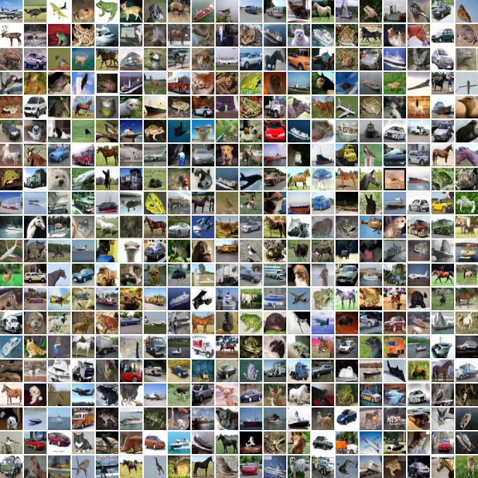

*图2: Figure 1: Generated samples on CelebA-HQ 256 × 256 (left) and unconditional CIFAR10 (right)*

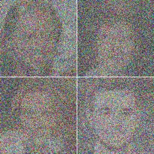

*图3: Figure 2: The directed graphical model considered in this work.*

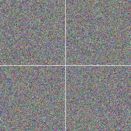

*图4: Figure 2: The directed graphical model considered in this work.*

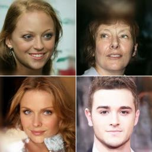

*图5: Figure 2: The directed graphical model considered in this work.*

### 相关图像

以下是论文中的相关图像：

*图1: Figure 1: Generated samples on CelebA-HQ 256 × 256 (left) and unconditional CIFAR10 (right)*

*图2: Figure 1: Generated samples on CelebA-HQ 256 × 256 (left) and unconditional CIFAR10 (right)*

*图3: Figure 2: The directed graphical model considered in this work.*

*图4: Figure 2: The directed graphical model considered in this work.*

*图5: Figure 2: The directed graphical model considered in this work.*

*图6: Figure 3: LSUN Church samples. FID=7.89*

*图7: Figure 3: LSUN Church samples. FID=7.89*

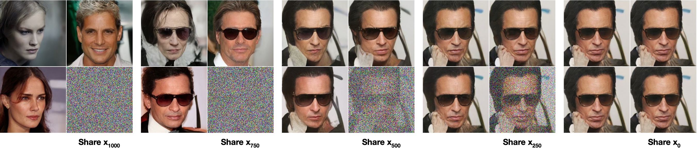

*图8: Figure 5: Unconditional CIFAR10 test set rate-distortion vs. time. Distortion is measured in root mean squarederror on a [0, 255] scale. See Table 4 for details.*

*图9: Figure 5: Unconditional CIFAR10 test set rate-distortion vs. time. Distortion is measured in root mean squarederror on a [0, 255] scale. See Table 4 for details.*

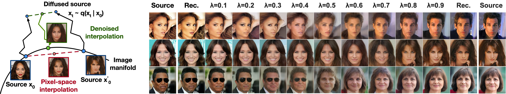

*图10: Figure 8: Interpolations of CelebA-HQ 256x256 images with 500 timesteps of diffusion.*

*图11: Figure 9: Coarse-to-fine interpolations that vary the number of diffusion steps prior to latent mixing.*

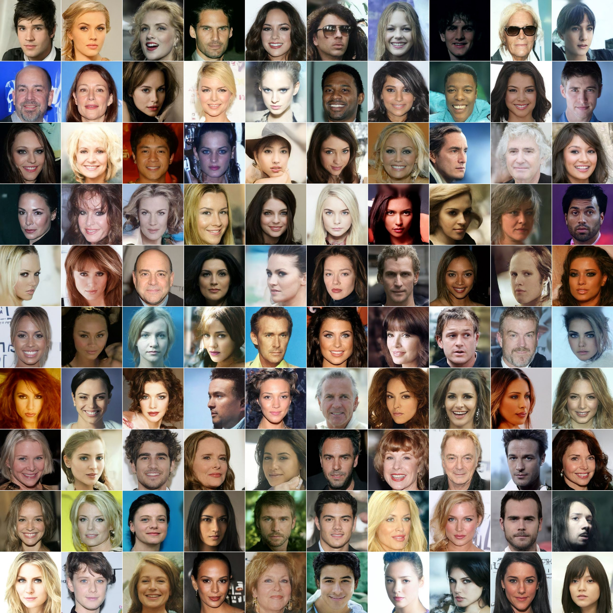

*图12: Figure 11: CelebA-HQ 256 × 256 generated samples*

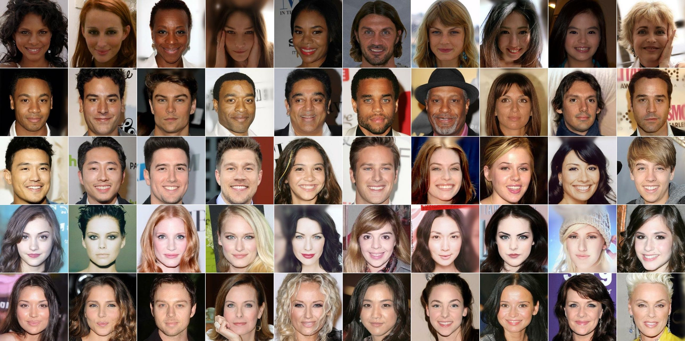

*图13: Figure 12: CelebA-HQ 256 × 256 nearest neighbors, computed on a 100 × 100 crop surrounding thefaces. Generated samples are in the leftmost column, and training set nearest neighbors are in theremaining columns.*

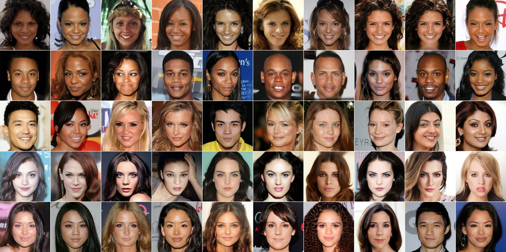

*图14: Figure 12: CelebA-HQ 256 × 256 nearest neighbors, computed on a 100 × 100 crop surrounding thefaces. Generated samples are in the leftmost column, and training set nearest neighbors are in theremaining columns.*

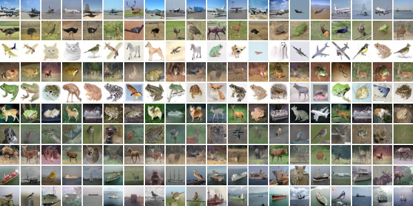

*图15: Figure 15: Unconditional CIFAR10 nearest neighbors. Generated samples are in the leftmost column,and training set nearest neighbors are in the remaining columns.*

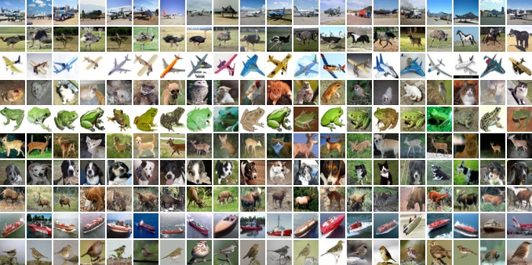

*图16: Figure 15: Unconditional CIFAR10 nearest neighbors. Generated samples are in the leftmost column,and training set nearest neighbors are in the remaining columns.*

*图17: Figure 16: LSUN Church generated samples. FID=7.89*

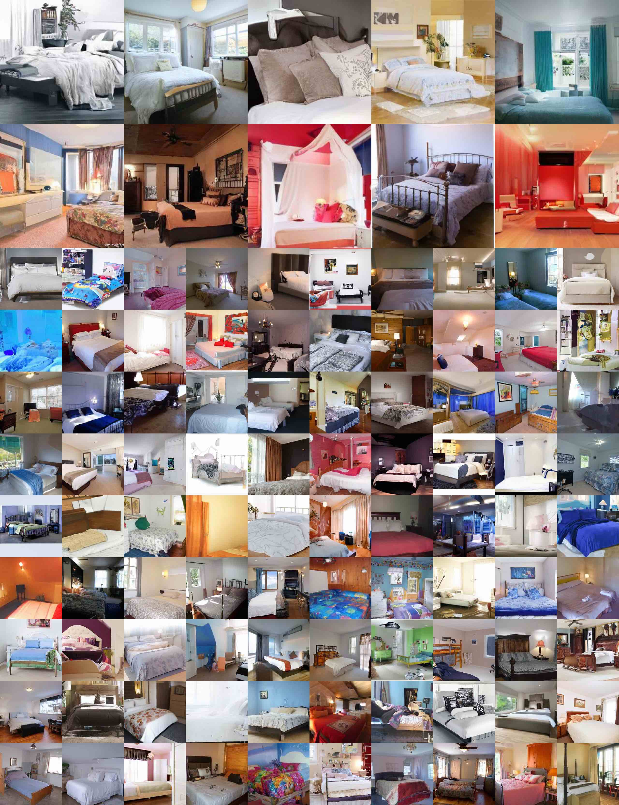

*图18: Figure 17: LSUN Bedroom generated samples, large model. FID=4.90*

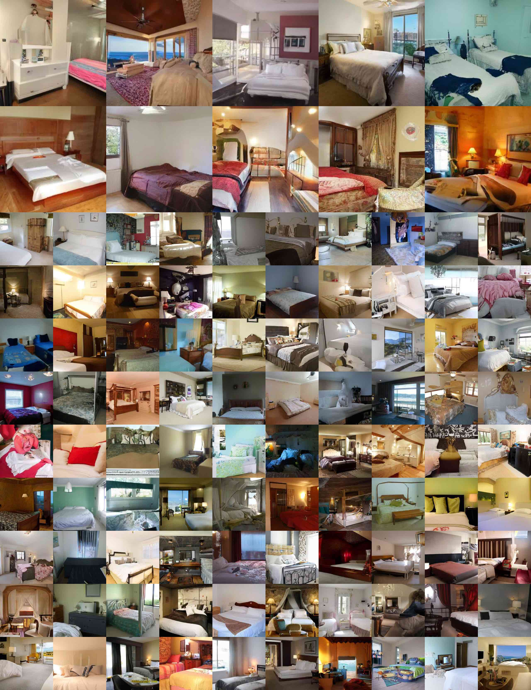

*图19: Figure 18: LSUN Bedroom generated samples, small model. FID=6.36*

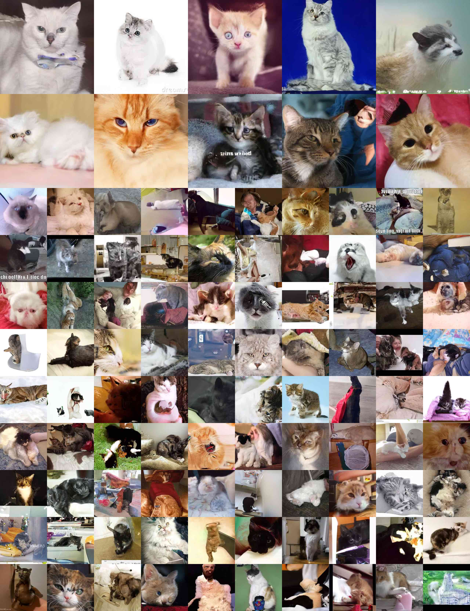

*图20: Figure 19: LSUN Cat generated samples. FID=19.75*

