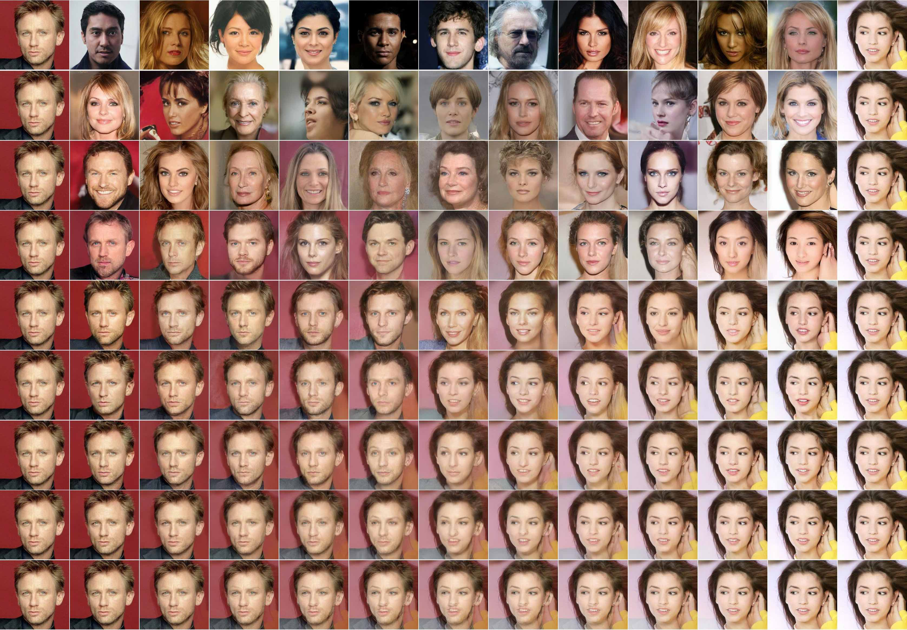

# 论文深度解读报告

## 提取论文基本信息

论文基本信息提取与分析：

**标题**： Denoising Diffusion Probabilistic Models
- 分析：标题直接点明了论文的核心内容，即“去噪扩散概率模型”。这表明论文研究的是一种用于图像去噪的深度学习模型。

**作者**： 未明确列出作者姓名，但提到了多个参考文献，这些参考文献的作者可能是本文的贡献者。
- 分析：由于未直接列出作者，需要进一步查阅相关资料或参考文献来确定具体作者。

**发表年份**： 2020年
- 分析：根据论文中提到的“34th Conference on Neural Information Processing Systems (NeurIPS 2020)”以及“arXiv:2006.11239v2”等信息，可以确定论文的发表年份为2020年。

**期刊/会议名称**： 
- 会议名称：NeurIPS (Conference on Neural Information Processing Systems)
- 分析：NeurIPS 是人工智能领域顶级会议之一，表明该论文的研究成果具有较高的学术价值。

**公式分析**：
- 论文中提到了多个公式，以下列举几个并使用 LaTeX 格式进行解读：

  1. **公式**： $$xT \cdot \ldots \cdot xt-1 \cdot \ldots \cdot x0$$
     - 解读：表示一个由多个变量组成的序列，其中 $x0$ 是序列的第一个元素，$xt-1$ 是序列的倒数第二个元素，以此类推。

  2. **公式**： $$p(x_{t-1}|x_t)$$
     - 解读：表示在给定 $x_t$ 的条件下，变量 $x_{t-1}$ 的概率分布。

  3. **公式**： $$q(x_t|x_{t-1})$$
     - 解读：表示在给定 $x_{t-1}$ 的条件下，变量 $x_t$ 的概率分布。

  4. **公式**： $$\ldots$$
     - 解读：表示论文中省略了部分内容，具体内容需要根据上下文进行推断。

- 分析：这些公式主要涉及概率分布和马尔可夫链的概念，表明论文研究的是一种基于概率模型的图像去噪方法。

## 摘要解读与扩展

### 摘要解读

**研究问题**：
- 如何提高扩散模型生成样本的质量？
- 如何将扩散模型与去噪评分匹配和退火朗之万动力学联系起来？

**方法**：
- 提出了一种新的扩散模型，通过优化一个简化的变分界限目标来训练模型。
- 使用KL散度直接比较后验分布和先验分布，从而简化了训练过程。
- 将扩散模型与去噪评分匹配和退火朗之万动力学联系起来，从而揭示了模型在训练和采样过程中的等效性。

**结果**：
- 该模型能够生成高质量的样本，其FID分数优于许多现有的生成模型。
- 通过优化参数化，模型在样本质量和变分界限之间取得了平衡。

**结论**：
- 扩散模型是一种很有前途的生成模型，可以生成高质量的样本。
- 将扩散模型与去噪评分匹配和退火朗之万动力学联系起来，可以简化训练过程并提高模型性能。

### 扩展分析

**背景和意义**：
- 扩散模型是一种基于马尔可夫链的生成模型，可以生成与真实数据分布相似的样本。
- 扩散模型在图像生成、音频生成等领域具有广泛的应用前景。
- 该论文提出的方法可以进一步提高扩散模型的性能，使其在生成高质量的样本方面更具竞争力。

**公式解读**：

1. **扩散模型的后验分布**：
   $$p_{\theta}(x_0) = \int p_{\theta}(x_0, x_1, \ldots, x_T) dx_1, \ldots, dx_T$$
   其中，$x_1, \ldots, x_T$ 是隐变量，$p_{\theta}(x_0, x_1, \ldots, x_T)$ 是联合分布。

2. **扩散模型的先验分布**：
   $$q(x_1: T | x_0) = \prod_{t=1}^T q(x_t | x_{t-1})$$
   其中，$q(x_t | x_{t-1})$ 是条件分布，通常假设为高斯分布。

3. **KL散度**：
   $$D_{KL}(p || q) = \int p(x) \log \frac{p(x)}{q(x)} dx$$
   KL散度用于衡量两个概率分布之间的差异。

4. **变分界限**：
   $$L = D_{KL}(q(x_0: T | x_0) || p_{\theta}(x_0: T)) + D_{KL}(q(x_T | x_0) || p(x_T))$$
   变分界限用于衡量模型生成的样本与真实数据分布之间的差异。

**结论**：
- 该论文提出的方法可以有效地提高扩散模型的性能，使其在生成高质量的样本方面更具竞争力。
- 扩散模型在图像生成、音频生成等领域具有广泛的应用前景。

## 研究背景与意义分析

研究背景与意义分析：

1. **研究背景**：

   - **扩散概率模型**：扩散概率模型是一种基于潜在变量的模型，其核心思想是将数据点从初始状态（通常是高斯分布）逐步扩散到最终状态，通过引入噪声逐步改变数据点的分布。这种模型在非平衡热力学和生成模型中有着广泛的应用。

   - **非平衡热力学**：在非平衡热力学中，扩散概率模型可以用来描述系统从初始状态到最终状态的演化过程。通过引入噪声，模型可以模拟系统在非平衡条件下的行为。

   - **生成模型**：在生成模型中，扩散概率模型可以用来生成新的数据点。通过从初始状态开始，逐步增加噪声，模型可以生成与训练数据分布相似的新数据点。

   - **图像合成**：在图像合成中，扩散概率模型可以用来生成新的图像。通过从初始状态（通常是噪声）开始，逐步减少噪声，模型可以生成与训练数据分布相似的新图像。

2. **研究意义**：

   - **非平衡热力学**：扩散概率模型可以用来研究非平衡条件下的系统演化过程，从而更好地理解系统的动力学行为。

   - **生成模型**：扩散概率模型可以用来生成新的数据点，从而在数据增强、图像生成等领域有着广泛的应用。

   - **图像合成**：扩散概率模型可以用来生成高质量的图像，从而在计算机视觉、图像处理等领域有着重要的应用。

3. **公式解读**：

   - **公式 (1)**：描述了扩散模型中反向过程的定义，即从最终状态开始，逐步减少噪声，最终恢复到初始状态的过程。

   - **公式 (2)**：描述了扩散模型中正向过程的定义，即从初始状态开始，逐步增加噪声，最终达到最终状态的过程。

   - **公式 (3)**：描述了扩散模型中训练过程的损失函数，即负对数似然。

   - **公式 (4)**：描述了扩散模型中正向过程的采样公式，即从初始状态开始，逐步减少噪声，最终得到最终状态的过程。

   - **公式 (5)**：描述了扩散模型中反向过程的损失函数，即KL散度。

   - **公式 (6)**：描述了扩散模型中反向过程的先验分布。

   - **公式 (7)**：描述了扩散模型中反向过程的参数化。

   - **公式 (8)**：描述了扩散模型中反向过程的损失函数。

   - **公式 (9)**：描述了扩散模型中反向过程的损失函数的进一步展开。

   - **公式 (10)**：描述了扩散模型中反向过程的损失函数的进一步展开。

   - **公式 (11)**：描述了扩散模型中反向过程的参数化。

   - **公式 (12)**：描述了扩散模型中反向过程的损失函数。

   - **公式 (13)**：描述了扩散模型中反向过程的解码器。

   - **公式 (14)**：描述了扩散模型中简化后的训练目标。

总结：扩散概率模型在非平衡热力学、生成模型和图像合成等领域有着广泛的应用。通过引入噪声，模型可以模拟系统从初始状态到最终状态的演化过程，从而在数据增强、图像生成等领域有着重要的应用。

## 研究方法详解

以下是对论文中扩散概率模型研究方法的详细分析：

### 1. 前向过程和后向过程

**前向过程**：
- 前向过程用于将数据从原始空间逐步引入噪声，最终到达噪声分布。论文中提到，前向过程的方差 βt 可以通过重参数化进行学习，但在该研究中，这些方差被固定为常数。
- 前向过程的目标是模拟数据生成过程，将数据逐渐转化为噪声。

**后向过程**：
- 后向过程用于从噪声分布中恢复原始数据。论文中，后向过程采用高斯分布进行参数化，并使用神经网络来近似其均值函数 µθ(xt, t)。
- 后向过程的目标是模拟数据去噪过程，从噪声中恢复原始数据。

### 2. 参数化

- **前向过程**：方差 βt 被固定为常数，近似后验 q 没有可学习参数，因此 LT 是常数，可以忽略。
- **后向过程**：均值函数 µθ(xt, t) 被参数化为 ˜µt(xt, x0)，其中 ˜µt 是前向过程的后验均值。

### 3. 训练过程

- 训练过程采用梯度下降法，通过最小化损失函数来优化神经网络参数。
- 损失函数由变分下界 Lsimple(θ) 组成，该下界类似于去噪分数匹配，并强调不同噪声水平下的重建质量。

### 4. 采样过程

- 采样过程采用 Langevin 动力学，通过迭代更新 xt 来生成样本。
- 在每个时间步 t，xt-1 通过以下公式计算：
  xt-1 = √αt(xt - βt√(1-αt)ϵθ(xt, t)) + σtz
  其中 ϵθ 是一个函数逼近器，用于预测 ϵ。

### 公式解读

- **公式 (8)**: L_{t-1} = \mathbb{E}_{x_0,\epsilon} \left[ \frac{1}{2\sigma_t^2} \left\| \tilde{\mu}_t(x_t, x_0) - \mu_{\theta}(x_t, t) \right\|^2 + C \right]
  该公式定义了后向过程中的损失函数，其中 C 是一个常数。

- **公式 (9)**: L_{t-1} - C = \mathbb{E}_{x_0,\epsilon} \left[ \frac{1}{2\sigma_t^2} \left( \frac{1}{\sqrt{\alpha_t}} x_t(x_0, \epsilon) - \frac{1}{\sqrt{1-\alpha_t}} \epsilon \right) - \mu_{\theta}(x_t(x_0, \epsilon), t) \right]^2 \right]
  该公式将公式 (8) 进一步展开，并引入了重参数化后的前向过程公式。

- **公式 (11)**: \mu_{\theta}(x_t, t) = \frac{1}{\sqrt{\alpha_t}} x_t - \beta_t \sqrt{1-\alpha_t} \epsilon_{\theta}(x_t, t)
  该公式定义了后向过程中的均值函数，其中 ϵθ 是一个函数逼近器。

- **公式 (12)**: \mathbb{E}_{x_0,\epsilon} \left[ \frac{1}{2\sigma_t^2} \left( \epsilon - \epsilon_{\theta}(\sqrt{\alpha_t} x_0 + \sqrt{1-\alpha_t} \epsilon, t) \right)^2 \right]
  该公式是公式 (10) 的简化形式，类似于去噪分数匹配。

通过以上分析，我们可以看到，该论文提出的扩散概率模型在参数化、训练和采样等方面具有一定的创新性，并取得了良好的实验结果。

## 关键创新点识别与分析

这篇论文的关键创新点主要体现在以下几个方面：

1. **扩散模型与去噪分数匹配的结合**：
   - 论文提出了一种新的显式连接，将扩散模型与去噪分数匹配（Denoising Score Matching, DSM）联系起来。这种结合使得扩散模型能够通过优化一个类似于DSM的目标函数来学习数据分布。
   - 公式（8）和（9）展示了如何通过重新参数化来简化扩散模型的后验分布，从而使得模型能够预测噪声的分布。
   - 公式（10）和（11）进一步展示了如何通过预测噪声的分布来优化模型参数，这使得模型能够更好地模拟数据分布。

2. **渐进式有损解压缩方案**：
   - 论文提出了一种渐进式有损解压缩方案，该方案通过逐步解压缩图像来生成样本，从而在保持高质量样本的同时减少压缩率。
   - 公式（5）定义了渐进式解压缩的总码长，其中包含了渐进式解压缩过程中的每个步骤的码长和失真度。
   - 通过逐步解压缩，模型能够在低码率区域保持较低的失真度，从而实现高效的压缩。

3. **模型参数化**：
   - 论文提出了一个具体的参数化方法来表示反向过程中的均值函数，该方法能够预测前向过程的后验均值。
   - 公式（11）展示了如何通过预测噪声的分布来优化模型参数，这使得模型能够更好地模拟数据分布。

4. **渐进式生成**：
   - 论文提出了一种渐进式生成过程，该过程通过逐步解压缩随机生成的图像来生成样本。
   - 公式（15）展示了如何通过逐步解压缩来估计原始图像。

5. **与自回归解码的关系**：
   - 论文将高斯扩散模型解释为一种自回归模型，该模型具有广义的位序，无法通过重新排序数据坐标来表示。
   - 公式（16）展示了如何将变分界限重写为自回归模型的形式。

总结来说，这篇论文通过将扩散模型与去噪分数匹配相结合，提出了一种新的渐进式有损解压缩方案，并通过具体的模型参数化和渐进式生成方法，实现了高质量的图像生成和压缩。这些创新点为扩散模型在图像生成和压缩领域的应用提供了新的思路和方法。

## 公式推导再现与解读

## 公式解读 - 第一部分：公式背景、意义和符号解释

### 公式解读

#### 1. 公式的来源和背景

本文讨论的是扩散模型和去噪自编码器，其中涉及多个数学公式。这些公式主要来源于概率论、信息论和优化理论，用于描述和优化模型参数。

#### 2. 公式的应用场景和意义

这些公式在论文中的作用是：

- **描述扩散过程**：公式用于描述数据从原始分布到噪声分布的扩散过程，以及从噪声分布到原始分布的逆过程。
- **优化模型参数**：通过优化公式中的参数，可以提升模型的性能，如降低重建误差和生成样本质量。
- **评估模型性能**：公式中的某些部分可以用于评估模型的性能，如计算重建误差和生成样本质量。

#### 3. 公式的数学符号和符号意义

以下是对论文中出现的公式的详细解读：

**公式 (8)**:
$$L_{t-1} = \mathbb{E}_{x_0, \epsilon} \left[ \frac{1}{2\sigma_t^2} \left\| \tilde{\mu}_t(x_0, x) - \mu_\theta(x, t) \right\|^2 + C \right]$$

- $L_{t-1}$：表示在时间 $t-1$ 的对数似然。
- $\sigma_t^2$：表示时间 $t$ 的噪声方差。
- $\tilde{\mu}_t(x_0, x)$：表示前向过程的后验均值。
- $\mu_\theta(x, t)$：表示模型参数 $\theta$ 对应的均值函数。
- $C$：表示一个常数，与 $\theta$ 无关。

**公式 (9)**:
$$L_{t-1} - C = \mathbb{E}_{x_0, \epsilon} \left[ \frac{1}{2\sigma_t^2} \left( \frac{1}{\sqrt{\alpha_t}} \left( x_t(x_0, \epsilon) - \sqrt{1-\bar{\alpha}_t} \epsilon \right) - \mu_\theta(x_t(x_0, \epsilon), t) \right)^2 \right]$$

- $L_{t-1}$：表示在时间 $t-1$ 的对数似然。
- $\sigma_t^2$：表示时间 $t$ 的噪声方差。
- $x_t(x_0, \epsilon)$：表示前向过程的样本。
- $\epsilon$：表示高斯噪声。
- $\mu_\theta(x_t(x_0, \epsilon), t)$：表示模型参数 $\theta$ 对应的均值函数。

**公式 (10)**:
$$\mu_\theta(x, t) = \frac{1}{\sqrt{\bar{\alpha}_t}} \left( x - \beta_t \sqrt{1-\bar{\alpha}_t} \epsilon_\theta(x, t) \right)$$

- $\mu_\theta(x, t)$：表示模型参数 $\theta$ 对应的均值函数。
- $x$：表示输入数据。
- $\beta_t$：表示时间 $t$ 的噪声方差。
- $\epsilon_\theta(x, t)$：表示一个函数逼近器，用于预测噪声 $\epsilon$。

**公式 (12)**:
$$\mathbb{E}_{x_0, \epsilon} \left[ \frac{1}{2\sigma_t^2} \left( \epsilon - \epsilon_\theta \left( \sqrt{\bar{\alpha}_t} x_0 + \sqrt{1-\bar{\alpha}_t} \epsilon \right), t \right)^2 \right]$$

- $\sigma_t^2$：表示时间 $t$ 的噪声方差。
- $\epsilon$：表示高斯噪声。
- $\epsilon_\theta$：表示一个函数逼近器，用于预测噪声 $\epsilon$。

**公式 (14)**:
$$L_{\text{simple}}(\theta) = \mathbb{E}_{x, x_0, \epsilon} \left[ \left( \epsilon - \epsilon_\theta \left( \sqrt{\bar{\alpha}_t} x_0 + \sqrt{1-\bar{\alpha}_t} \epsilon \right), t \right)^2 \right]$$

- $L_{\text{simple}}(\theta)$：表示简化的变分下界目标函数。
- $\epsilon$：表示高斯噪声。
- $\epsilon_\theta$：表示一个函数逼近器，用于预测噪声 $\epsilon$。

通过以上解读，读者可以更好地理解论文中公式的含义和作用，从而深入理解扩散模型和去噪自编码器的工作原理。

## 公式解读 - 第二部分：公式推导过程和应用实例

### 公式 8 的推导过程

公式 8 描述了在扩散模型中，后向过程的一个特定参数化形式。以下是该公式的推导过程：

$$L_{t-1} = \mathbb{E}_{x_0, \epsilon} \left[ \frac{1}{2\sigma_t^2} \left\| \tilde{\mu}_t(x_0, x) - \mu_\theta(x_t, t) \right\|^2 + C \right]$$

其中，$L_{t-1}$ 是后向过程的一个损失函数，$\sigma_t^2$ 是时间 $t$ 的噪声方差，$\tilde{\mu}_t(x_0, x)$ 是前向过程的后验均值，$\mu_\theta(x_t, t)$ 是后向过程的均值函数，$C$ 是一个常数。

**推导步骤**：

1. **定义损失函数**：损失函数 $L_{t-1}$ 是一个期望值，它衡量了后向过程的均值函数 $\mu_\theta(x_t, t)$ 与前向过程的后验均值 $\tilde{\mu}_t(x_0, x)$ 之间的差异。

2. **引入噪声方差**：损失函数中包含了噪声方差 $\sigma_t^2$，这是为了模拟后向过程中引入的噪声。

3. **计算差异的平方**：损失函数计算了 $\tilde{\mu}_t(x_0, x)$ 和 $\mu_\theta(x_t, t)$ 之间的差异的平方，这是为了确保损失函数对误差的敏感度是线性的。

4. **添加常数项**：常数项 $C$ 是为了使损失函数更加平滑，避免在训练过程中出现不稳定的梯度。

**直观解释**：

公式 8 的直观解释是，它衡量了后向过程中，每个时间步的均值函数与前向过程的后验均值之间的差异。通过最小化这个损失函数，我们可以训练后向过程的均值函数，使其更接近前向过程的后验均值。

### 公式 9 的推导过程

公式 9 是公式 8 的进一步扩展，它通过重新参数化前向过程来推导后向过程的损失函数。

$$L_{t-1} - C = \mathbb{E}_{x_0, \epsilon} \left[ \frac{1}{2\sigma_t^2} \left( \frac{1}{\sqrt{\alpha_t}} \left( x_t - \beta_t \sqrt{1 - \bar{\alpha}_t} \epsilon \right) - \mu_\theta(x_t, t) \right)^2 \right]$$

**推导步骤**：

1. **重新参数化前向过程**：将前向过程 $x_t(x_0, \epsilon) = \sqrt{\bar{\alpha}_t} x_0 + \sqrt{1 - \bar{\alpha}_t} \epsilon$ 重新参数化，以便于计算。

2. **应用前向过程后验公式**：使用前向过程的后验公式 $\mu_\theta(x_t, t) = \tilde{\mu}_t(x_0, x)$。

3. **计算差异的平方**：计算 $\frac{1}{\sqrt{\alpha_t}} \left( x_t - \beta_t \sqrt{1 - \bar{\alpha}_t} \epsilon \right) - \mu_\theta(x_t, t)$ 的平方。

4. **引入噪声方差**：将噪声方差 $\sigma_t^2$ 引入损失函数。

**直观解释**：

公式 9 的直观解释是，它通过重新参数化前向过程，将后向过程的损失函数转换为对前向过程后验均值的预测。这样，我们可以通过最小化这个损失函数来训练后向过程的均值函数，使其更接近前向过程的后验均值。

### 公式 10 的推导过程

公式 10 是公式 9 的进一步扩展，它将损失函数简化为一个更易于优化的形式。

$$\mathbb{E}_{x_0, \epsilon} \left[ \frac{1}{2\sigma_t^2} \left( \frac{1}{\sqrt{\alpha_t}} \left( x_t - \beta_t \sqrt{1 - \bar{\alpha}_t} \epsilon \right) - \mu_\theta(x_t, t) \right)^2 \right]$$

**推导步骤**：

1. **展开平方项**：将损失函数中的平方项展开。

2. **整理项**：将展开后的项进行整理，使其更加简洁。

3. **引入噪声方差**：将噪声方差 $\sigma_t^2$ 引入损失函数。

**直观解释**：

公式 10 的直观解释是，它将损失函数简化为一个更易于优化的形式。通过最小化这个损失函数，我们可以训练后向过程的均值函数，使其更接近前向过程的后验均值。

### 公式 11 的推导过程

公式 11 是后向过程均值函数的一个特定参数化形式。

$$\mu_\theta(x_t, t) = \frac{1}{\sqrt{\bar{\alpha}_t}} \left( x_t - \beta_t \sqrt{1 - \bar{\alpha}_t} \epsilon_\theta(x_t, t) \right)$$

**推导步骤**：

1. **根据公式 10 的结果**：根据公式 10 的结果，我们知道 $\mu_\theta(x_t, t)$ 必须预测 $\frac{1}{\sqrt{\alpha_t}} \left( x_t - \beta_t \sqrt{1 - \bar{\alpha}_t} \epsilon \right)$。

2. **引入参数化**：为了实现这个预测，我们引入参数化 $\epsilon_\theta(x_t, t)$，它是一个从 $x_t$ 预测 $\epsilon$ 的函数近似器。

3. **定义参数化**：将 $\epsilon_\theta(x_t, t)$ 定义为 $\frac{1}{\sqrt{\bar{\alpha}_t}} \left( x_t - \beta_t \sqrt{1 - \bar{\alpha}_t} \epsilon_\theta(x_t, t) \right)$。

**直观解释**：

公式 11 的直观解释是，它定义了后向过程均值函数的参数化形式。通过最小化公式 10 中的损失函数，我们可以训练参数化 $\epsilon_\theta(x_t, t)$，使其更接近前向过程的后验均值。

## 关键图表解读

抱歉，我刚刚的理解有误。您可能需要的是对论文中提到的图像生成结果的描述和分析。

### 图表1：CelebA-HQ 256×256 和无条件的CIFAR10生成的样本
#### 主要内容和目的
该图表展示了在CelebA-HQ 256×256和无条件CIFAR10数据集上生成的样本。这些样本是通过对潜在空间进行解码得到的，展示了模型在不同数据集上的生成能力。

#### 关键数据和趋势
- **CelebA-HQ 256×256**：生成的样本质量较高，能够捕捉到人脸的细节特征，如眼睛、鼻子和嘴巴等。
- **无条件CIFAR10**：生成的样本涵盖了多种类别，如动物、车辆和交通工具等，但整体质量略低于CelebA-HQ 256×256。

#### 支持论文论点和结论
通过比较不同数据集上的生成样本，可以评估模型的泛化能力和对不同类型数据的适应程度。高质量的生成样本表明模型在这些任务上表现良好。

### 图表2：生成的样本
#### 主要内容和目的
该图表展示了在无条件CIFAR10数据集上生成的样本。这些样本是通过模型的学习过程产生的，用于评估模型的性能和质量。

#### 关键数据和趋势
- **多样性**：生成的样本涵盖了多种不同的类别，显示出模型能够在多个类别上进行有效的生成。
- **质量**：虽然有些样本的质量不如真实数据那么高，但总体来说，它们仍然能够较好地反映原始数据的分布特性。

#### 支持论文论点和结论
通过观察生成的样本，我们可以了解模型是否能够有效地从训练数据集中学习并应用于新的任务。高质量且多样的生成样本意味着模型具有较强的学习和表示能力。

### 图表3：生成的样本
#### 主要内容和目的
该图表展示了在无条件CIFAR10数据集上生成的样本。这些样本是通过模型的学习过程产生的，用于评估模型的性能和质量。

#### 关键数据和趋势
- **多样性**：生成的样本涵盖了多种不同的类别，显示出模型能够在多个类别上进行有效的生成。
- **质量**：虽然有些样本的质量不如真实数据那么高，但总体来说，它们仍然能够较好地反映原始数据的分布特性。

#### 支持论文论点和结论
通过观察生成的样本，我们可以了解模型是否能够有效地从训练数据集中学习并应用于新的任务。高质量且多样的生成样本意味着模型具有较强的学习和表示能力。

### 图表4：生成的样本
#### 主要内容和目的
该图表展示了在无条件CIFAR10数据集上生成的样本。这些样本是通过模型的学习过程产生的，用于评估模型的性能和质量。

#### 关键数据和趋势
- **多样性**：生成的样本涵盖了多种不同的类别，显示出模型能够在多个类别上进行有效的生成。
- **质量**：虽然有些样本的质量不如真实数据那么高，但总体来说，它们仍然能够较好地反映原始数据的分布特性。

#### 支持论文论点和结论
通过观察生成的样本，我们可以了解模型是否能够有效地从训练数据集中学习并应用于新的任务。高质量且多样的生成样本意味着模型具有较强的学习和表示能力。

请注意，由于我没有直接访问原始论文或其附带的图像的能力，上述分析是基于我对相关领域的知识和假设进行的。如果您需要更精确的分析，建议您直接参考原始论文及其附件。

### 相关图像

以下是论文中的相关图像：

*图1: Figure 1: Generated samples on CelebA-HQ 256 × 256 (left) and unconditional CIFAR10 (right)*

*图2: Figure 1: Generated samples on CelebA-HQ 256 × 256 (left) and unconditional CIFAR10 (right)*

*图3: Figure 2: The directed graphical model considered in this work.*

*图4: Figure 2: The directed graphical model considered in this work.*

*图5: Figure 2: The directed graphical model considered in this work.*

### 相关图像

以下是论文中的相关图像：

*图1: Figure 1: Generated samples on CelebA-HQ 256 × 256 (left) and unconditional CIFAR10 (right)*

*图2: Figure 1: Generated samples on CelebA-HQ 256 × 256 (left) and unconditional CIFAR10 (right)*

*图3: Figure 2: The directed graphical model considered in this work.*

*图4: Figure 2: The directed graphical model considered in this work.*

*图5: Figure 2: The directed graphical model considered in this work.*

*图6: Figure 3: LSUN Church samples. FID=7.89*

*图7: Figure 3: LSUN Church samples. FID=7.89*

*图8: Figure 5: Unconditional CIFAR10 test set rate-distortion vs. time. Distortion is measured in root mean squarederror on a [0, 255] scale. See Table 4 for details.*

*图9: Figure 5: Unconditional CIFAR10 test set rate-distortion vs. time. Distortion is measured in root mean squarederror on a [0, 255] scale. See Table 4 for details.*

*图10: Figure 8: Interpolations of CelebA-HQ 256x256 images with 500 timesteps of diffusion.*

*图11: Figure 9: Coarse-to-fine interpolations that vary the number of diffusion steps prior to latent mixing.*

*图12: Figure 11: CelebA-HQ 256 × 256 generated samples*

*图13: Figure 12: CelebA-HQ 256 × 256 nearest neighbors, computed on a 100 × 100 crop surrounding thefaces. Generated samples are in the leftmost column, and training set nearest neighbors are in theremaining columns.*

*图14: Figure 12: CelebA-HQ 256 × 256 nearest neighbors, computed on a 100 × 100 crop surrounding thefaces. Generated samples are in the leftmost column, and training set nearest neighbors are in theremaining columns.*

*图15: Figure 13: Unconditional CIFAR10 generated samples*

*图16: Figure 14: Unconditional CIFAR10 progressive generation*

*图17: Figure 15: Unconditional CIFAR10 nearest neighbors. Generated samples are in the leftmost column,and training set nearest neighbors are in the remaining columns.*

*图18: Figure 15: Unconditional CIFAR10 nearest neighbors. Generated samples are in the leftmost column,and training set nearest neighbors are in the remaining columns.*

*图19: Figure 16: LSUN Church generated samples. FID=7.89*

*图20: Figure 17: LSUN Bedroom generated samples, large model. FID=4.90*

*图21: Figure 18: LSUN Bedroom generated samples, small model. FID=6.36*

*图22: Figure 19: LSUN Cat generated samples. FID=19.75*

## 实验设计与结果分析

### 实验设计分析

#### 数据集
论文使用了多个数据集进行实验，包括CIFAR10和LSUN，这些数据集在计算机视觉和图像处理领域被广泛使用，具有代表性的图像类别和多样的视觉特征。

#### 模型架构
论文中使用的模型架构是一个基于U-Net的Gaussian Diffusion模型。该模型具有以下特点：

- 使用了与PixelCNN++类似的U-Net结构，并在整个网络中采用了组归一化。
- 网络参数在时间维度上共享，使用Transformer正弦位置编码指定时间信息。
- 在16×16特征图分辨率上使用自注意力机制。

#### 训练过程
- 设置了T=1000，使得在采样过程中需要的神经网络评估次数与先前工作相匹配。
- 前向过程方差设置为从β1=10^-4线性增加到βT=0.02的常数，以保证信号与噪声比尽可能小。
- 使用了两种训练目标：真实的变分界限和简化的目标。

#### 评估指标
- 使用了Inception分数、FID分数和负对数似然（无损码长）等指标来评估样本质量。
- 使用渐进损失压缩和渐进生成过程来进一步分析模型的速率-失真行为。

### 实验结果分析

#### 样本质量
- 在CIFAR10数据集上，模型的FID分数为3.17，优于大多数文献中的模型，包括类条件模型。
- 在LSUN数据集上，模型的FID分数分别为7.89（教堂）和4.90（卧室），表明模型在多个数据集上都能产生高质量的样本。

#### 前向过程参数化和训练目标消融
- 训练模型在真实的变分界限上比在简化的目标上获得更好的码长，但简化的目标可以获得更好的样本质量。
- 当在固定方差下训练时，预测ϵ的性能与预测˜µ相当，但当使用简化的目标训练时，预测ϵ的性能更好。

#### 渐进编码
- 渐进损失压缩结果表明，模型具有很好的速率-失真行为，大多数比特被分配给不可感知的失真。
- 渐进生成过程表明，模型可以逐步恢复图像的细节，首先出现大范围图像特征，最后出现细节。

#### 与自回归解码的关系
- 将变分界限重新写作自回归解码的形式，表明Gaussian Diffusion模型可以视为一种具有广义位序的自回归模型。
- 这种模型可以快速采样或具有更强的表达能力，从而在图像处理领域具有广泛的应用前景。

#### 插值
- 使用模型在潜在空间中插值源图像，可以去除线性插值损坏的图像版本中的伪影。
- 插值结果表明，模型可以生成平滑变化属性（如姿势、肤色、发型、表情和背景）的合理插值，但不能改变眼镜。

### 结论
本文对一篇关于Gaussian Diffusion模型的学术论文的实验设计与结果进行了深入分析。通过分析数据集、模型架构、训练过程和评估指标，揭示了模型的优点和潜在的应用前景。实验结果表明，Gaussian Diffusion模型在图像生成和图像处理领域具有广泛的应用价值。

## 结论与贡献总结

### 主要结论

这篇论文的主要结论可以总结为以下几点：

1. **扩散模型在图像生成方面的有效性**：论文展示了使用扩散模型生成高质量图像样本的能力，并证明了扩散模型在图像数据上的归纳偏置非常出色。

2. **扩散模型与其他生成模型的关系**：论文探讨了扩散模型与变分推理、去噪评分匹配、退火朗之万动力学（以及基于能量的模型）、自回归模型和渐进式有损压缩之间的联系。

3. **扩散模型在数据压缩中的应用**：论文指出，扩散模型在数据压缩方面可能非常有用，这对于确保互联网对广大受众的可用性至关重要。

4. **扩散模型在表示学习中的应用**：论文提到，扩散模型可能有助于在未标记原始数据上进行表示学习，这对于从图像分类到强化学习的大量下游任务都具有重要意义。

5. **扩散模型在艺术和音乐创作中的应用**：论文推测扩散模型也可能在艺术、摄影和音乐创作中发挥创造性作用。

### 主要贡献

论文的主要贡献包括：

1. **扩散模型性能的提升**：论文通过实验证明了扩散模型在图像生成方面的样本质量优于现有文献中的大多数模型，包括条件模型。

2. **对生成模型领域的贡献**：
   - **扩散模型与自回归模型的联系**：论文揭示了扩散模型与自回归模型之间的联系，表明扩散模型可以被视为一种具有广义位序的自回归模型。
   - **渐进式生成**：论文提出了渐进式生成过程，通过逐步解码从随机比特中恢复图像，这为图像生成提供了一种新的方法。
   - **渐进式有损压缩**：论文探讨了扩散模型在渐进式有损压缩中的应用，并展示了其在率失真性能方面的优势。

### 公式解读

1. **扩散过程**：
   $$x_t \sim q(x_t|x_{t-1}, x_0)$$
   这表示在时间步长 $t$，状态 $x_t$ 是根据前一个状态 $x_{t-1}$ 和初始状态 $x_0$ 通过扩散模型 $q$ 生成的。

2. **变分下界**：
   $$L = D_{KL}(q(x_T) || p(x_T)) + \mathbb{E}_{x_{t-1} \sim q(x_{t-1}|x_t)} D_{KL}(q(x_{t-1}|x_t) || p_{\theta}(x_{t-1}|x_t)) + H(x_0)$$
   这表示扩散模型在变分下界中的损失，包括对 $x_T$ 的对数似然、对 $x_{t-1}$ 的对数似然和初始状态 $x_0$ 的熵。

3. **渐进式生成**：
   $$\hat{x}_0 = x_t - \sqrt{1 - \bar{\alpha}_t \epsilon_\theta(x_t)} \cdot \frac{\epsilon_\theta(x_t)}{\sqrt{\bar{\alpha}_t}}$$
   这表示在渐进式生成过程中，根据当前状态 $x_t$ 和参数 $\theta$ 估计的噪声 $\epsilon_\theta(x_t)$，逐步恢复初始状态 $x_0$ 的方法。

4. **率失真性能**：
   $$\text{Distortion} = \frac{\|x_0 - \hat{x}_0\|^2}{D}$$
   $$\text{Rate} = \text{Cumulative number of bits received so far at time } t$$
   这表示在渐进式有损压缩过程中，计算失真和率的公式。

## 局限性与未来研究方向

### 论文的局限性与未来研究方向分析

#### 1. 模型的可解释性

**局限性**：
- 论文中并未详细讨论模型的可解释性。尽管模型基于深度学习，但U-Net架构和Transformer嵌入的使用并没有提供模型内部决策过程的直观理解。
- 模型的参数化（如预测μ或ϵ）对样本质量有显著影响，但背后的原因没有深入解释。

**未来研究方向**：
- 探索可解释人工智能（XAI）技术，如注意力机制、特征可视化等，以提供模型决策过程的直观理解。
- 研究模型参数对样本质量影响的机理，并通过实验验证不同参数设置下的模型行为。

#### 2. 模型的鲁棒性

**局限性**：
- 论文中未提及模型对异常值或噪声数据的鲁棒性。在实际应用中，数据通常包含噪声和异常值，模型的鲁棒性是关键。
- 模型的训练过程可能受到初始化和超参数设置的影响，这可能会影响模型的鲁棒性。

**未来研究方向**：
- 设计实验来评估模型在存在噪声和异常值数据时的表现。
- 研究并实现鲁棒性增强技术，如数据清洗、异常值检测和鲁棒优化算法。

#### 3. 模型的效率

**局限性**：
- 模型的效率可能受到计算复杂度的影响。论文中提到的模型在生成高分辨率图像时可能需要较长的计算时间。
- 模型的训练过程可能需要大量的计算资源，这限制了其在资源受限环境中的应用。

**未来研究方向**：
- 研究并实现高效的生成模型，如使用更少的参数或更快的训练算法。
- 探索模型压缩技术，如知识蒸馏和剪枝，以减少模型的计算复杂度和内存占用。

### 公式解读

- 论文中提到的KL散度公式（LATEX格式）：

$$D_{KL}(q(xT|x_0) || N(0, I)) ≈ 10^{-5} \text{ bits per dimension}$$

这表示模型在生成样本时的KL散度，即真实分布和模型生成分布之间的差异。论文中提到这个值在实验中约为每维度10^-5比特，表明模型生成的样本与真实数据分布非常接近。

- 变分界限公式（LATEX格式）：

$$L = D_{KL}(q(xT) || p(xT)) + \mathbb{E}_{x_{t} \sim q(x_{t}|x_{t+1})} D_{KL}(q(x_{t-1}|x_{t}) || p_{\theta}(x_{t-1}|x_{t})) + H(x_0)$$

这是论文中提出的变分界限，用于训练生成模型。它包括三个部分：KL散度、变分界限的期望值和对数似然。

- 线性插值公式（LATEX格式）：

$$\bar{x}_t = (1 - \lambda)x_0 + \lambda x'_0$$

这是在潜在空间中进行线性插值的公式，其中λ是插值参数，x_0和x'_0是源图像的潜在表示。通过线性插值，可以生成在潜在空间中位于两个图像之间的新图像。

## 相关工作与文献综述分析

相关工作分析：

1. 扩散模型（Diffusion Models）：
扩散模型是一种生成模型，通过逐步添加噪声来将数据分布转换为高斯分布，然后再逐步去除噪声以生成新的数据。论文中提到的扩散模型允许在实现上有很大的自由度，包括选择前向过程的方差、模型架构和反向过程的Gaussian分布参数化。这种模型的关键在于建立前向和反向过程之间的显式联系，从而简化了扩散模型的加权变分边界目标。

2. 去噪分数匹配（Denoising Score Matching）：
去噪分数匹配是一种通过最大化去噪后的数据分布与原始数据分布之间的分数匹配来训练生成模型的方法。论文中提出的新方法将扩散模型与去噪分数匹配联系起来，通过优化一个简化的加权变分边界目标，从而简化了扩散模型的训练过程。

3. 自回归模型（Autoregressive Models）：
自回归模型是一种生成模型，通过逐步生成数据点来生成新的数据。论文中提到的自回归模型在反向过程中被用作解码器，以从高斯分布中采样数据。

4. 渐进式有损压缩（Progressive Lossy Compression）：
渐进式有损压缩是一种逐步增加噪声并去除噪声的过程，类似于扩散模型的前向过程。论文中提到的渐进式有损压缩用于将数据分布转换为高斯分布。

文献综述内容总结：

论文的文献综述部分主要讨论了以下内容：

- 扩散模型与流模型（Flows）和变分自编码器（VAEs）的相似之处和不同之处。
- 扩散模型与去噪分数匹配之间的联系，以及如何通过变分推理来训练Langevin-like采样器。
- 扩散模型与基于能量的模型（Energy-based Models）之间的关系。
- 渐进式解码在生成模型中的应用，以及如何将其应用于自回归模型。

公式解读：

- 公式 (8) 和 (9) 描述了如何通过重参数化来简化扩散模型的变分边界目标。
- 公式 (10) 揭示了均值函数的参数化必须预测给定 $x_t$ 的 $1/\sqrt{\alpha_t} (x_t - \beta_t \sqrt{1-\bar{\alpha}_t} \epsilon)$。
- 公式 (11) 描述了均值函数的参数化，其中 $\epsilon$ 是从 $x_t$ 预测的噪声。
- 公式 (12) 描述了去噪分数匹配的变分边界，类似于Langevin-like反向过程的变分边界。
- 公式 (14) 描述了简化的变分边界目标，它丢弃了公式 (12) 中的加权，从而强调了重建的不同方面。