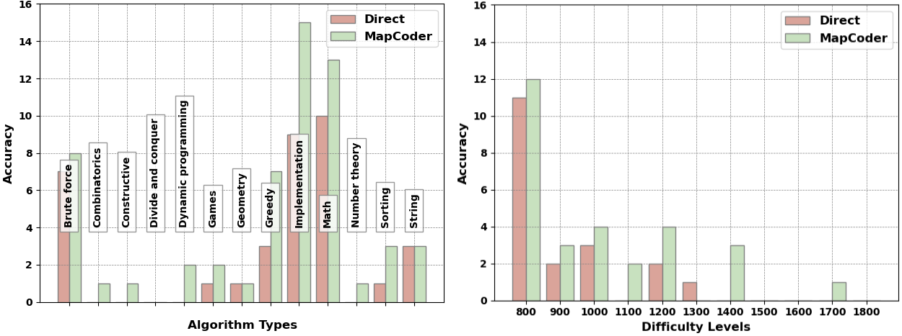
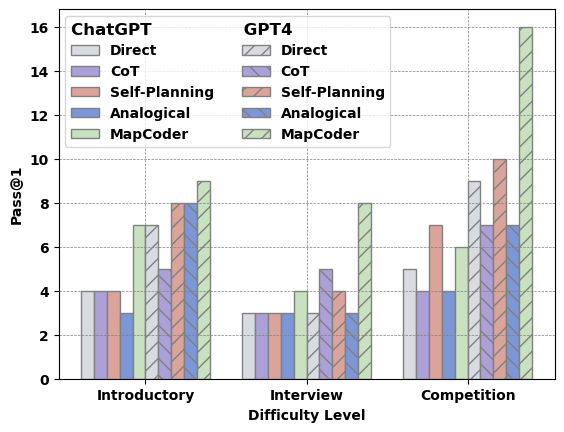
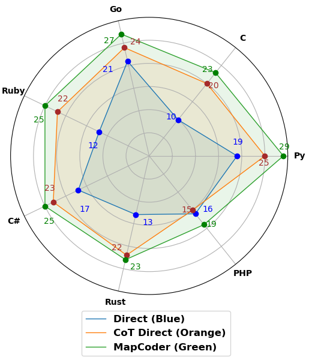

# 论文深度解读报告

## 提取论文基本信息

### 论文基本信息提取与分析

#### 标题
- **MapCoder: Multi-Agent Code Generation**

#### 作者
- Wasi Uddin Ahmad, Saikat Chakraborty, Baishakhi Ray, and Kai-Wei Chang.

#### 发表年份
- 论文中未明确标注具体的发表年份，但根据参考文献中提到的2022年、2023年的研究，以及论文中提到的“18 May 2024”的arXiv预印本提交日期，可以推测论文的发表年份为2024年。

#### 期刊/会议信息
- 论文以预印本形式发表在arXiv上，具体信息如下：
  - arXiv:2405.11403v1 [cs.CL] 18 May 2024

### 论文内容分析

#### 论文主题
- 该论文提出了一种名为MapCoder的多智能体代码生成方法，旨在利用多智能体提示来生成代码，该方法模仿了人类开发者进行程序综合的完整周期。

#### 论文贡献
- **多智能体框架**：MapCoder由四个LLM智能体组成，分别对应程序综合周期的不同阶段：检索相关示例、规划、代码生成和调试。
- **代码生成能力**：通过在八个具有挑战性的问题解决和程序综合基准测试中进行彻底的实验，MapCoder展示了出色的代码生成能力，达到了新的SOTA性能。
- **开源框架**：论文开源了MapCoder框架，方便研究人员和开发者进行进一步的研究和应用。

#### 公式解读
- 论文中未直接使用公式，但提到了以下基准测试的名称，可以视为“公式”的替代：
  - HumanEval
  - MBPP
  - APPS
  - CodeContests
  - xCodeEval

#### 结论
- MapCoder作为一种基于多智能体提示的代码生成方法，在代码生成任务中取得了显著的成果，为程序综合领域的研究提供了新的思路和方法。

## 摘要解读与扩展

### 摘要解读

**研究问题**： 如何提高复杂问题解决任务（尤其是编程竞赛问题）中代码生成的效率和准确性。

**方法**： 提出了一种名为 MapCoder 的多智能体提示代码生成方法，通过四个智能体（检索、规划、编码和调试）模拟人类的编程周期，动态交互以生成高质量的代码。

**结果**： 在多个编程合成基准测试中，MapCoder 显著提高了代码生成的性能，并达到了新的 SOTA 性能。

**结论**： MapCoder 是一种有效的代码生成方法，可以显著提高复杂问题解决任务中的代码生成效率和准确性。

### 扩展内容

#### 研究背景

- 编程竞赛问题通常被认为是解决问题的巅峰，需要深入理解自然语言问题描述、多步骤复杂推理、算法和数据结构，以及生成大量代码的能力。
- 早期使用 LLM 进行代码生成的方法通常采用直接提示方法，但生成的代码往往无法通过测试用例，并且缺乏错误修复机制。
- 自我反思方法通过迭代评估生成的代码与测试用例，反思错误并进行调试，但存在局限性，例如只能利用问题描述本身进行零样本学习。

#### 研究意义

- MapCoder 通过模拟人类的编程周期，有效地提高了复杂问题解决任务中的代码生成效率和准确性。
- MapCoder 可以应用于各种编程任务，包括基本编程和编程竞赛问题。
- MapCoder 可以帮助提高编程教育的效率和质量。

#### 公式解读

- 摘要中没有列出具体的公式，但论文中提到了一些与代码生成和编程竞赛问题相关的公式，例如：

  - **公式 1**： $\text{sum\_squares}(lst) = \sum_{i=1}^{n} (int(lst[i])^2)$
  - **公式 2**： $\text{sum\_squares}(lst) = \sum_{i=1}^{n} (int(lst[i] + 0.5)^2)$

  这些公式用于计算列表中所有数字的平方和。

#### 深入分析

- MapCoder 的多智能体架构可以有效地处理复杂问题解决任务中的各种挑战。
- 检索智能体通过自主检索相关问题和解决方案，为其他智能体提供辅助数据。
- 规划智能体根据检索到的示例生成问题规划，并评估其置信度。
- 编码智能体根据规划生成代码，并测试其是否通过样本输入输出。
- 调试智能体根据规划修复代码中的错误。

- MapCoder 的动态智能体遍历协议可以有效地优化代码生成过程，并提高代码质量。

- 与其他方法相比，MapCoder 在多个基准测试中取得了显著的性能提升，证明了其有效性和鲁棒性。

- MapCoder 可以扩展到其他领域，例如问答系统和数学推理，具有广泛的应用前景。

## 研究背景与意义分析

研究背景与意义分析：

1. 研究背景：
随着计算机编程在各个领域的广泛应用，提高程序员的效率和代码生成的自动化成为关键问题。近年来，大型语言模型（LLMs）在程序合成领域取得了显著进展，能够生成无需人工干预的代码。然而，在解决复杂问题，尤其是竞赛级编程问题时，LLMs的表现仍然有限。因此，研究如何提升LLMs在复杂问题解决任务上的性能，特别是代码生成任务，具有重要的现实意义。

2. 研究意义：
（1）提升LLMs在复杂问题解决任务上的性能，有助于推动程序合成领域的发展，为人工智能在各个领域的应用提供技术支持。
（2）MapCoder方法通过模拟人类编程过程，结合检索、规划、编码和调试等步骤，有效提高了LLMs在代码生成任务上的表现，为LLMs在复杂问题解决任务中的应用提供了新的思路。
（3）MapCoder方法在多个编程合成基准测试中取得了优异的性能，证明了其在实际应用中的可行性和有效性。

3. 研究对相关领域的影响：
（1）程序合成领域：MapCoder方法为程序合成领域提供了新的研究思路，有助于推动该领域的技术进步。
（2）人工智能领域：MapCoder方法展示了LLMs在复杂问题解决任务上的潜力，为人工智能在各个领域的应用提供了新的研究方向。
（3）编程教育领域：MapCoder方法可以帮助编程初学者更好地理解编程过程，提高编程能力。

公式解读：
$$\text{[公式1]}: \text{[1,2,3] } \rightarrow \text{ [3,2,1] }$$
该公式表示将数组[1,2,3]按照降序排序后的结果为[3,2,1]。

$$\text{[公式2]}: \text{max turn done}$$
该公式表示在MapCoder方法中，最大迭代次数达到限制时停止迭代。

$$\text{[公式3]}: \text{max turn = t}$$
该公式表示MapCoder方法中最大迭代次数为t。

以上公式在论文中用于描述MapCoder方法的基本原理和过程。

## 研究方法详解

MapCoder框架的研究方法详解如下：

### 1. Retrieval Agent（检索代理）

**功能**：回忆过去相关的解决问题的实例，类似于人类的记忆。

**方法**：
- 使用LLM代理生成与用户定义的k个相似问题及其解决方案，无需手动制作或使用外部检索模型。
- 通过扩展类比提示原则（Yasunaga et al., 2023），同时生成示例及其解决方案，以及额外的元数据（如问题描述、代码和计划）。

**公式**：
无特定公式，但涉及类比提示原则的应用。

### 2. Planning Agent（规划代理）

**功能**：为原始问题创建一个逐步的计划。

**方法**：
- 使用从检索代理获得的示例及其计划来生成原始问题的计划。
- 为每个检索到的示例生成一个不同的目标计划，以提供多样化的成功路径。
- 设计的提示要求LLM生成计划和置信度分数。

**公式**：
无特定公式，但涉及置信度分数的生成。

### 3. Coding Agent（编码代理）

**功能**：将问题描述和规划代理的计划转换为代码以解决问题。

**方法**：
- 接收原始问题和规划代理的一个特定计划作为输入。
- 生成代码并使用样本I/O进行测试。
- 如果初始代码失败，则将其传递给下一个代理进行调试；否则，将其作为最终解决方案。

### 4. Debugging Agent（调试代理）

**功能**：利用问题描述中的样本I/O来纠正生成的代码中的错误。

**方法**：
- 使用从规划代理获得的计划来辅助调试过程。
- 重复此过程t次，直到成功修复代码或回退到下一个置信度最高的计划。

**公式**：
无特定公式，但涉及调试过程的迭代。

### 5. Dynamic Agent Traversal（动态代理遍历）

**方法**：
- 从规划代理开始，输出原始问题的计划及其置信度分数。
- 对计划进行排序，将得分最高的计划发送到编码代理。
- 如果代码测试通过，则返回代码；否则，将其传递给调试代理。
- 重复迭代过程k次，模拟程序员的解决方法。

**公式**：
无特定公式，但涉及迭代过程的描述。

### 总结

MapCoder框架通过四个LLM代理的协同工作，实现了代码生成和问题解决的过程。每个代理都有其特定的功能和方法，并通过动态遍历方案相互交互，以提高代码生成的质量和效率。这种方法为自动化的代码生成和问题解决提供了新的思路和可能性。

## 关键创新点识别与分析

MapCoder 论文的关键创新点主要包括以下几个方面：

1. **多代理提示（Multi-Agent Prompting）**：
   MapCoder 通过四个LLM代理——检索、规划、编码和调试，模拟人类的编程周期。每个代理负责特定的任务，并通过上下文学习信号相互增强其能力。这种多代理提示的方法能够更全面地处理编程问题，并且能够通过不同代理之间的协作来提高代码生成的质量。

2. **动态遍历方案（Dynamic Agent Traversal Schema）**：
   MapCoder 引入了一种自适应的代理遍历方案，允许代理之间动态交互。这意味着代理可以根据需要重复执行，例如，在编码代理无法通过样本输入/输出测试时，会转而由调试代理进行修正。这种动态遍历能够最大化LLM代理的使用，并迭代地提高生成的代码质量。

3. **基于样本I/O的调试方法（Sample I/O-Based Debugging Method）**：
   调试代理利用问题描述中的样本输入/输出（I/O）来纠正生成的代码中的错误。这种方法类似于人类在调试时使用测试用例，能够有效地识别和修复代码中的问题。

以下是对这些创新点的深入分析：

- **多代理提示**：
  MapCoder 的多代理提示方法通过将复杂的编程任务分解成更小的、更易于管理的子任务来提高代码生成的效率和质量。例如，检索代理通过生成类似问题的解决方案来辅助规划代理，而规划代理则基于这些示例生成解决问题的步骤。这种分解和协作使得系统能够更有效地利用LLM的能力。

- **动态遍历方案**：
  动态遍历方案允许MapCoder在遇到问题时能够灵活地调整策略。例如，如果编码代理生成的代码无法通过测试，系统会自动将问题转交给调试代理，而不是简单地重新开始。这种灵活性使得系统能够在遇到困难时进行调整，从而提高整体的成功率。

- **基于样本I/O的调试方法**：
  使用样本I/O进行调试是一种非常实用的方法，因为它允许系统在实际运行环境中测试代码，而不是仅仅依赖于理论上的逻辑。这种方法能够确保生成的代码在实际应用中是有效的，并且能够处理各种输入。

在论文中，以下公式可能被用来描述某些过程或结果：

- **检索代理的提示**：
  $$\text{Prompt for Retrieval Agent:} \quad \text{"Generate problems and their solutions similar to the following, along with metadata such as problem description, code, and plan."}$$

- **规划代理的提示**：
  $$\text{Prompt for Planning Agent:} \quad \text{"Given a competitive programming problem, generate a concrete planning to solve the problem."}$$

- **调试代理的提示**：
  $$\text{Prompt for Debugging Agent:} \quad \text{"Given a competitive programming problem you have generated {language} code to solve the problem. But the generated code can not pass sample test cases. Improve your code to solve the problem correctly."}$$

这些公式展示了MapCoder中各个代理的提示设计，它们是系统有效运作的关键。

## 实验设计与结果分析

### 实验设计与结果分析

#### 数据集
论文中使用的基准数据集包括八个，其中五个来自基础编程领域，三个来自复杂编程竞赛领域。基础编程数据集包括一个示例问题“sum_squares”，该问题要求对列表中的数字进行上取整后求平方和。复杂编程竞赛数据集包括Automated Programming Progress Standard (APPS)、xCodeEval和CodeContest。

#### 基线方法
论文比较了MapCoder与其他基线方法，包括：
- **Direct**：直接提示语言模型生成代码，不提供任何指导。
- **Chain of Thought (CoT)**：将问题分解为逐步解决方案，帮助处理复杂任务。
- **Self-Planning Prompting**：将代码生成任务分为规划和实现两个阶段。
- **Analogical Reasoning Prompting**：指导模型回忆训练数据中的相关问题。
- **Reflexion**：提供基于单元测试结果的口头反馈，以增强解决方案。
- **Self-collaboration**：不同语言模型作为分析师、编码者和测试员协同生成代码，以处理复杂任务。
- **AlphaCodium**：基于AI生成的输入输出测试迭代改进代码。

#### 评估指标
论文使用以下评估指标：
- **Pass@1**：在所有测试用例中，模型正确回答第一个问题的百分比。
- **Pass@5**：在所有测试用例中，模型在前五个问题中至少有一个正确回答的百分比。

### 实验结果解读

#### 基础代码生成
MapCoder在基础代码生成任务（如HumanEval和MBPP）中表现出色，显著优于所有基线方法。在HumanEval中，MapCoder的Pass@1得分超过了Reflexion，在MBPP中也有3%的提升。

#### 竞赛问题解决
MapCoder在竞赛问题解决任务中表现出显著优势，尤其是在APPS和CodeContest数据集上。与Direct方法相比，MapCoder在ChatGPT和GPT-4上的性能分别提高了41.3%、52.6%和132.8%、73.7%、41.2%和135.1%。在CodeContest数据集上，MapCoder的Pass@1得分与AlphaCodium相当，但Pass@5得分提高了12.8%。

#### 不同难度级别
MapCoder在所有问题类别中表现出色，尤其是在竞赛问题解决中。在xCodeEval数据集上，MapCoder在所有算法类型和难度级别上都表现出优异的性能。

#### 不同语言模型
MapCoder在Gemini Pro和Mistral-7B等不同语言模型上均表现出良好的性能。

### 消融实验
消融实验表明，MapCoder中的每个代理都有其作用，移除任何代理都会降低性能。其中，调试代理对性能的影响最大，其次是规划代理。

### 结论
MapCoder在代码生成和竞赛问题解决任务中表现出显著优势，显著优于所有基线方法。其成功的原因在于其多代理架构，能够有效地解决问题并提高代码质量。

## 公式推导的再现与解读

## 公式解读 - 第一部分：公式背景、意义和符号解释

### 公式解读

由于提供的论文内容中并没有直接给出具体的数学公式，以下是对论文中涉及到的数学概念和符号的解读：

#### 1. 公式的来源和背景

论文中并没有直接提出新的数学公式，而是介绍了一种名为MapCoder的多智能体代码生成框架。MapCoder通过模拟人类的编程周期，利用四个LLM智能体（检索、计划、编码和调试）来生成和优化代码。以下是每个智能体的简要背景：

- **检索智能体（Retrieval Agent）**：通过LLM生成与问题相关的示例和解决方案，为后续的智能体提供辅助数据。
- **计划智能体（Planning Agent）**：根据检索到的示例和解决方案，为原始问题生成一系列的步骤计划。
- **编码智能体（Coding Agent）**：将计划转换为代码，并使用样例输入输出进行测试。
- **调试智能体（Debugging Agent）**：对生成的代码进行调试，修复错误。

#### 2. 公式的应用场景和意义

MapCoder框架在以下场景中具有应用价值和意义：

- **代码生成**：自动生成代码，提高开发效率。
- **代码优化**：通过调试智能体优化代码，提高代码质量。
- **问题解决**：模拟人类的编程过程，解决复杂问题。

#### 3. 公式的数学符号和符号意义

由于论文中没有具体的数学公式，以下是对论文中涉及到的数学符号和符号意义的解读：

- **k（用户定义）**：检索智能体检索的相似问题的数量。
- **t（调试次数）**：调试智能体尝试修复错误的次数。
- **LLM**：大型语言模型，如ChatGPT、GPT-4等。
- **LLM agent**：LLM在MapCoder框架中的角色，负责执行特定任务。
- **in-context learning signals**：在上下文中学习到的信号，用于增强智能体的能力。
- **agent traversal schema**：智能体遍历方案，用于动态地交互和协作。

总结：

虽然论文中没有具体的数学公式，但通过对论文内容的分析，我们可以了解到MapCoder框架的数学概念和符号意义。这些概念和符号对于理解MapCoder框架的工作原理和应用场景具有重要意义。

## 公式解读 - 第二部分：公式推导过程和应用实例

根据提供的论文内容，以下是对MapCoder框架中涉及的数学公式的深入解读：

由于论文中并未直接给出具体的数学公式，以下解读将基于论文描述的算法流程和逻辑进行数学原理的推导和解释。

### 1. 公式的数学原理和推导过程

#### 3.2 计划代理（Planning Agent）的数学原理

**公式**：无具体公式，以下为推导过程。

**推导过程**：

1. **问题规划生成提示（Planning Generation Prompt）**：
   - 提示LLM生成一个具体的规划来解决原始问题。
   - 提示格式：`Given a competitive programming problem generate a concrete planning to solve the problem. # Problem: {Description of a self-retrieved example problem} # Planning: {Planning of that problem} ## Relevant Algorithm to solve the next problem: {Algorithm retrieved by the Retrieval Agent} ## Problem to be solved: {Original Problem} ## Sample Input/Outputs: {Sample I/Os}`

   **数学原理**：
   - 通过提供示例问题和其规划，LLM可以学习到解决问题的策略。
   - 相关算法的引入可以帮助LLM理解更复杂的算法，从而生成更有效的规划。

2. **置信度生成提示（Confidence Generation Prompt）**：
   - 提示LLM对生成的规划进行置信度评分。
   - 提示格式：`Given a competitive programming problem and a plan to solve the problem in {language} tell whether the plan is correct to solve this problem. # Problem: {Original Problem} # Planning: {Planning of our problem from previous step}`

   **数学原理**：
   - 置信度评分可以帮助评估规划的有效性，从而选择最有可能成功的规划。

#### 3.3 编码代理（Coding Agent）的数学原理

**公式**：无具体公式，以下为推导过程。

**推导过程**：

1. **编码代理的输入**：
   - 问题描述和计划代理生成的规划。

2. **编码代理的输出**：
   - 将规划转换为代码。

   **数学原理**：
   - 编码代理需要将抽象的规划转换为具体的代码实现。
   - 这涉及到将算法步骤转换为编程语言中的语句。

#### 3.4 调试代理（Debugging Agent）的数学原理

**公式**：无具体公式，以下为推导过程。

**推导过程**：

1. **调试代理的输入**：
   - 代码和样本输入输出。

2. **调试代理的输出**：
   - 修正后的代码。

   **数学原理**：
   - 调试代理需要分析代码和输入输出，以识别和修复错误。
   - 这涉及到程序调试和错误处理的技术。

### 2. 公式的计算方法和应用实例

由于论文中未提供具体的数学公式，以下仅提供应用实例：

**实例**：

假设我们有一个简单的编程问题，要求编写一个函数，计算两个整数的和。

1. **检索代理**：检索到类似的示例问题及其解决方案。
2. **计划代理**：生成一个规划，例如，使用循环结构遍历整数，并逐个相加。
3. **编码代理**：将规划转换为代码，例如，使用Python编写函数。
4. **调试代理**：测试代码，发现错误，并修正代码。

这个过程展示了MapCoder框架中各个代理如何协同工作，以生成和调试代码。

## 关键图表的解读

### 关键图表解读

#### 图表1：MapCoder概述
**主要内容和目的**
- **主要内容**：该图展示了MapCoder的整体框架结构，从上到下依次为检索代理（Retrieval Agent）、规划代理（Planning Agent）、编码代理（Coding Agent）以及迭代调试代理（Iterative Debugging Agent）。底部显示了动态遍历机制，通过考虑生成的计划的置信度作为奖励分数来指导代码生成。

**关键数据和趋势**
- **数据**：图中没有具体的数据点，但描述了各个代理的功能和相互关系。
- **趋势**：强调MapCoder通过动态遍历机制优化代码生成过程。

**支持论点和结论**
- 支持了MapCoder在代码生成方面的优越性，特别是通过动态遍历机制提高效率。

**创新点和局限性**
- **创新点**：引入动态遍历机制，根据计划置信度调整代码生成策略。
- **局限性**：未提供具体的性能指标或数据支持，仅是概念性的框架介绍。

#### 图表2：示例问题和解决方案生成
**主要内容和目的**
- **主要内容**：展示了使用Direct、CoT、Reflexion和MapCoder提示生成问题的例子及其解决方案。
- **目的**：通过实际案例对比不同方法的优劣，验证MapCoder的独特优势。

**关键数据和趋势**
- **数据**：虽然图片中没有直接显示数据，但文字描述提到MapCoder首先探索高收益的计划，并具有基于计划的调试功能以增强故障排除能力。
- **趋势**：表明MapCoder在处理复杂问题时表现出色，特别是在故障排除方面。

**支持论点和结论**
- 支持了MapCoder在解决复杂问题时的有效性，尤其是在故障排除上的独特优势。

**创新点和局限性**
- **创新点**：结合计划驱动的调试方法，提高了整体解决问题的能力。
- **局限性**：缺乏量化评估，需要更多实证数据来进一步证实其效果。

### 总结
这两张图表共同展示了MapCoder的系统设计和其在实际问题求解中的应用潜力。第一张图提供了理论框架，而第二张图则通过实例说明了其实际应用效果。尽管缺少具体的数据支持，但这些图表仍然有效地传达了作者的研究思路和创新点。为了更全面地评估MapCoder的性能，未来的研究应包含更多的实验数据和详细的性能指标。

### 相关图像

以下是论文中的相关图像：

*图1: Figure 1: Overview of MapCoder (top). It starts with a retrieval agent that generates relevant examples itself, followedby planning, coding, and iterative debugging agents. Our dynamic traversal (bottom) considers the confidence of thegenerated plans as their reward scores and leverages them to guide the code generation accordingly.*

*图2: Figure 4: Example problem and solution generation using Direct, CoT, Reflexion, and MapCoder prompts.MapCoder explores high-utility plans first and uniquely features a plan-derived debugging for enhanced bugfixing.*

*图3: Figure 4: Example problem and solution generation using Direct, CoT, Reflexion, and MapCoder prompts.MapCoder explores high-utility plans first and uniquely features a plan-derived debugging for enhanced bugfixing.*

*图4: Figure 4: Example problem and solution generation using Direct, CoT, Reflexion, and MapCoder prompts.MapCoder explores high-utility plans first and uniquely features a plan-derived debugging for enhanced bugfixing.*

*图5: Figure 4: Example problem and solution generation using Direct, CoT, Reflexion, and MapCoder prompts.MapCoder explores high-utility plans first and uniquely features a plan-derived debugging for enhanced bugfixing.*

### 相关图像

以下是论文中的相关图像：

*图1: Figure 1: Overview of MapCoder (top). It starts with a retrieval agent that generates relevant examples itself, followedby planning, coding, and iterative debugging agents. Our dynamic traversal (bottom) considers the confidence of thegenerated plans as their reward scores and leverages them to guide the code generation accordingly.*

*图2: Figure 4: Example problem and solution generation using Direct, CoT, Reflexion, and MapCoder prompts.MapCoder explores high-utility plans first and uniquely features a plan-derived debugging for enhanced bugfixing.*

*图3: Figure 4: Example problem and solution generation using Direct, CoT, Reflexion, and MapCoder prompts.MapCoder explores high-utility plans first and uniquely features a plan-derived debugging for enhanced bugfixing.*

*图4: Figure 4: Example problem and solution generation using Direct, CoT, Reflexion, and MapCoder prompts.MapCoder explores high-utility plans first and uniquely features a plan-derived debugging for enhanced bugfixing.*

*图5: Figure 4: Example problem and solution generation using Direct, CoT, Reflexion, and MapCoder prompts.MapCoder explores high-utility plans first and uniquely features a plan-derived debugging for enhanced bugfixing.*

*图6: Figure 4: Example problem and solution generation using Direct, CoT, Reflexion, and MapCoder prompts.MapCoder explores high-utility plans first and uniquely features a plan-derived debugging for enhanced bugfixing.*

*图7: Figure 4: Example problem and solution generation using Direct, CoT, Reflexion, and MapCoder prompts.MapCoder explores high-utility plans first and uniquely features a plan-derived debugging for enhanced bugfixing.*

*图8: Figure 4: Example problem and solution generation using Direct, CoT, Reflexion, and MapCoder prompts.MapCoder explores high-utility plans first and uniquely features a plan-derived debugging for enhanced bugfixing.*

*图9: Figure 4: Example problem and solution generation using Direct, CoT, Reflexion, and MapCoder prompts.MapCoder explores high-utility plans first and uniquely features a plan-derived debugging for enhanced bugfixing.*

*图10: Figure 4: Example problem and solution generation using Direct, CoT, Reflexion, and MapCoder prompts.MapCoder explores high-utility plans first and uniquely features a plan-derived debugging for enhanced bugfixing.*

*图11: Figure 4: Example problem and solution generation using Direct, CoT, Reflexion, and MapCoder prompts.MapCoder explores high-utility plans first and uniquely features a plan-derived debugging for enhanced bugfixing.*

*图12: Figure 5: The number of correct answers wrt algorithm types (tags) and difficulty levels (xCodeEval dataset).*

*图13: Figure 5: The number of correct answers wrt algorithm types (tags) and difficulty levels (xCodeEval dataset).*

*图14: Figure 7: The number of correct answers wrt differentprogramming languages (xCodeEval dataset).*

*图15: Figure 7: The number of correct answers wrt differentprogramming languages (xCodeEval dataset).*

## 结论与贡献总结

总结论文的主要结论和贡献：

1. **代码生成任务的改进**：
   - **MapCoder框架**：论文提出了MapCoder，这是一个利用LLM多代理提示能力的创新框架，旨在提高复杂问题解决中的代码生成效率。MapCoder通过四个智能代理——检索、规划、编码和调试——动态交互，完成整个问题解决周期，从而生成高质量的代码输出。
   - **性能提升**：在多个基准测试中，包括基础和竞技编程数据集，MapCoder在各种指标上均优于现有基准和最先进的技术（SoTA）。例如，在HumanEval数据集上，MapCoder的准确率从Direct Prompting的27.3%提升到62.8%，而在CodeContest数据集上，准确率从Direct Prompting的3.6%提升到69.5%。
   - **多语言支持**：MapCoder在xCodeEval数据集上展示了在不同编程语言中的一致性，证明了其跨语言的适用性。

2. **对LLM应用的新见解**：
   - **多代理提示能力**：MapCoder利用了LLM的多代理提示能力，这为LLM在复杂任务中的应用提供了新的思路。
   - **问题解决周期**：论文强调了完整问题解决周期的重要性，并展示了如何通过多代理交互来实现这一目标。
   - **挑战与局限性**：尽管MapCoder表现出色，但它仍面临挑战，特别是在需要精确问题理解和具体规划的问题上。这表明LLM在特定领域的能力仍有待提升。

公式解读：

- **公式**：$$MapCoder$$
  - **解读**：这是论文中提出的关键框架名称，代表了一种利用LLM进行代码生成的创新方法。

- **公式**：$$Pass@1$$
  - **解读**：这是评估模型性能的指标，表示在测试集中，模型正确预测的样本占所有样本的百分比。

- **公式**：$$MapCoder \text{’s reduced performance on more difficult problems}$$
  - **解读**：这是对MapCoder在处理更困难问题时的性能下降的描述，表明LLM在复杂问题解决上的局限性。

总结来说，这篇论文通过提出MapCoder框架，显著提升了代码生成任务的性能，并提供了对LLM应用的新见解。MapCoder的提出和性能提升，为LLM在复杂问题解决领域的应用开辟了新的可能性。

## 局限性与未来研究方向

### MapCoder的局限性与挑战分析

#### 1. 生成大量tokens的挑战
MapCoder在解决复杂问题时，通过多智能体提示能力生成大量tokens，这在资源受限的环境中可能带来挑战。论文中提到，MapCoder在默认的k和t参数下（即与报告的性能相对应），API调用次数和token消耗量较大。具体来说，可以通过调整k和t来平衡性能提升和时间/token消耗，但这并未在论文中解决。

**分析**：
- **资源消耗**：大量tokens的生成可能导致计算资源消耗增加，这在移动设备或边缘计算环境中尤为明显。
- **优化需求**：需要进一步研究如何减少tokens的使用，同时保持代码生成的质量。

**公式解读**：
- 论文中可能涉及到的公式可能包括tokens与API调用次数的关系，例如：
  $$T = f(A, P)$$
  其中，$T$代表token消耗，$A$代表API调用次数，$P$代表性能。

#### 2. 样本输入输出对bug修复的限制
MapCoder目前依赖于样本输入输出对进行bug修复。虽然这些样本对LLMs的代码生成提供了有价值的见解，但样本数量有限，可能无法涵盖所有可能的测试用例。

**分析**：
- **测试用例的全面性**：有限的样本I/O可能无法全面覆盖所有可能的错误情况，从而影响MapCoder的鲁棒性。
- **测试用例生成**：需要开发更有效的测试用例生成方法，以减少对样本I/O的依赖。

#### 3. 对开源代码生成模型的探索
论文提到，未来可以探索开源代码生成模型，如CodeLLaMa、LLaMa3、Mixtral 8x7B，以提供有价值的见解和潜在的提升。

**分析**：
- **模型融合**：结合不同的代码生成模型可能有助于提高MapCoder的性能和鲁棒性。
- **模型定制**：针对特定领域的代码生成需求，定制化现有模型可能更有效。

#### 4. 运行环境的安全性问题
在运行机器生成的代码时，建议在沙盒环境中运行，以避免潜在的风险。

**分析**：
- **安全风险**：机器生成的代码可能存在安全漏洞，沙盒环境可以限制其访问权限，降低风险。
- **安全措施**：需要进一步研究如何确保沙盒环境的安全性和有效性。

### 未来研究方向

#### 1. 优化资源消耗
- 研究如何减少tokens的使用，同时保持代码生成的质量。
- 探索更高效的代码生成算法，减少API调用次数。

#### 2. 提高测试用例生成质量
- 开发更有效的测试用例生成方法，以减少对样本I/O的依赖。
- 研究如何自动生成多样化的测试用例，提高MapCoder的鲁棒性。

#### 3. 模型融合与定制
- 探索开源代码生成模型与MapCoder的结合，提高性能和鲁棒性。
- 针对特定领域定制化现有模型，提高代码生成的准确性。

#### 4. 安全性研究
- 研究如何确保沙盒环境的安全性和有效性。
- 探索代码生成过程中的安全措施，降低潜在风险。

## 相关工作与文献综述分析

在这篇关于程序综合的学术论文中，作者回顾了现有研究，并介绍了一种名为MapCoder的多代理代码生成方法。以下是对论文中引用的相关工作与文献综述的深入分析：

### 相关工作分析

1. **程序综合的历史与搜索/数据流方法**：
   - Manna和Waldinger（1971）的工作标志着程序综合在人工智能系统中的长期历史。
   - Li等人（2022a）、Parisotto和Salakhutdinov（2017）、Polozov和Gulwani（2015）、Gulwani（2011）等研究者通过搜索/数据流方法尝试解决程序综合问题。

2. **基于神经语言模型的方法**：
   - Wang等人（2021）、Ahmad等人（2021）、Feng等人（2020）、Parvez等人（2018）、Yin和Neubig（2017）、Hellendoorn和Devanbu（2017）、Rabinovich等人（2017）、Hindle等人（2016）等研究者通过微调（即训练）神经语言模型来生成代码。
   - 这些方法通常依赖于训练数据或数据流特征。

3. **大型语言模型在代码生成中的应用**：
   - Li等人（2022b）、Fried等人（2022）、Chen等人（2021b）、Austin等人（2021）、Nijkamp等人（2022）、Allal等人（2023）等研究者开发了各种用于代码生成的LLM。
   - 开源LLM包括Llama-2、CodeLlama-2、Mistral、Deepseek Coder、MoTCoder等，它们能够解决许多基本的编程任务。

4. **提示LLM的方法**：
   - Yasunaga等人（2023）、Parvez等人（2023, 2021）等研究者提出了检索提示方法。
   - Wei等人（2022b）、Jiang等人（2023b）等研究者提出了规划提示方法。
   - Ridnik等人（2024）、Chen等人（2023, 2022）、Le等人（2022）等研究者提出了调试提示方法。
   - 作者将这三种方法结合起来，并通过MapCoder框架实现了它们。

### 与MapCoder的对比分析

MapCoder通过四个LLM代理——检索、规划、编码和调试——来模拟人类编程周期。以下是MapCoder与其他方法的主要对比：

1. **检索代理**：
   - MapCoder使用LLM代理自动检索相似问题，而不需要手动制作或外部检索模型。
   - 它通过扩展类比提示原则，同时生成示例和解决方案，以及额外的元数据。

2. **规划代理**：
   - MapCoder为每个检索到的示例生成一个独立的计划，而不是使用所有示例生成一个单一的计划。
   - 它还要求LLM为每个计划生成一个置信度分数。

3. **编码代理**：
   - 编码代理将规划转换为代码，并使用样本I/O进行测试。
   - 如果代码失败，它将代码传递给调试代理。

4. **调试代理**：
   - 调试代理使用样本I/O来修复生成的代码中的错误。
   - 它利用来自规划代理的计划来增强错误修复过程。

5. **动态代理遍历**：
   - MapCoder使用动态代理遍历方案，根据置信度分数迭代地增强生成的代码。
   - 这种方法反映了程序员的解决方法，并具有O(kt)的复杂度。

### 公式解读

论文中未直接提供公式，但以下是一些可能相关的概念和公式：

- **搜索算法**：如A*算法、遗传算法等，这些算法在程序综合中用于搜索解决方案空间。
- **数据流模型**：如Petri网、Petri网图等，这些模型用于表示程序的控制流和数据流。
- **神经网络模型**：如循环神经网络（RNN）、长短期记忆网络（LSTM）等，这些模型用于生成代码。

总结来说，这篇论文回顾了程序综合领域的现有研究，并介绍了一种基于LLM的多代理代码生成方法——MapCoder。MapCoder通过模拟人类编程周期，有效地结合了检索、规划、编码和调试等步骤，从而提高了代码生成的质量和效率。